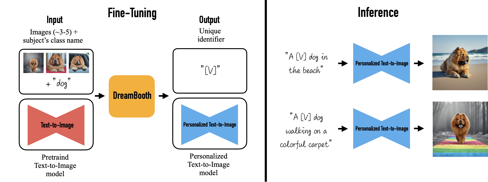
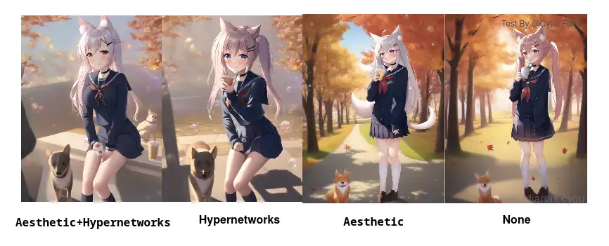

# 模型精调

>Todo 
>材料
>
> https://github.com/huggingface/diffusers/issues/712
>
> https://github.com/AUTOMATIC1111/stable-diffusion-webui/pull/2002
>
> https://github.com/ShivamShrirao/diffusers/tree/main/examples/dreambooth


这节对显卡的要求较高。

在法律上，**不应该**无视画师约定的版权许可，采集作品数据进行训练。在道德上，**不应该**用训练结果贬低原画师作品价值，俗谚有 “吃水不忘挖井人”，训练数据并不能作为你的贡献。

## 模型训练的不同方法

如果你在 `--medvram` 参数下开始训练，可能会出现 `RuntimeError: Expected all tensors to be on the same device` 错误，无法创建训练。
这是优化机制导致的[问题](https://github.com/AUTOMATIC1111/stable-diffusion-webui/issues/2399)，WebUI 在 [这次提交](https://github.com/AUTOMATIC1111/stable-diffusion-webui/commit/cbb857b675cf0f169b21515c29da492b513cc8c4) 中允许了在 `--medvram` 下创建 embedding 的情况。请更新版本到这个版本之后。

**关于 batch size**

更大的 batch size 可能稍微加快训练并稍微提升训练效果，但也需要更大的显存。


### Textual Inversion (TI)

从一些具有共同语义 [v] 的图片中，提取 [v] 的一个方法。提取出的 [v] 张量称之为 "Embedding"。将 Embedding 保存为文件，之后生成图片时就可以在 prompt 中以文件名引用。

#### 特征

训练产物大小较小，WebUI 自带训练支持。

可以解决新出的角色画不出的问题，或者模仿特定的可以用语言精确描述的艺术风格。因为 TI 是在 Text Encoder 的输出做处理，所以并不能让模型学习到它不知道的概念。

#### 使用

使用时，将 embedding（一个 .pt 、一个 .bin 文件或新版图片格式 .png / .webp / .avif / .jxl）放入 webui 的 `embeddings` 目录并在 prompt 中写要用的 embedding 的文件名（不包括扩展名）即可，不必重启 webui。可以同时使用多个 embedding。

#### 相关

[webui 给的英文说明和效果图](https://github.com/AUTOMATIC1111/stable-diffusion-webui/wiki/Textual-Inversion)

[相关 embeddings](https://gitlab.com/16777216c/stable-diffusion-embeddings)，里面有相关效果预览。

[list of Textual Inversion embeddings for webui(SD)](https://rentry.org/embeddings)

[HuggingFace 的 embedding 库](https://cyberes.github.io/stable-diffusion-textual-inversion-models/)


### Hypernetwork (HN)

一类给模型生成权重的网络，在这里是给 LDM(潜在扩散模型) 生成权重。是一个较为实验性的方法，NovelAI 率先探索了在 LDM 上使用。

#### 特征

与 TI 不同，Hypernetwork 会改动 LDM 本身的权重，所以可以训练出无法用语言精确表述的细节，也更适用于画风的训练。

训练产物大小中等，WebUI 自带训练支持。

#### 使用

使用时，将 Pt 放入 `/models/hypernetworks` 并在设置选项勾选启用它。

NAI Leaks 的 `novelaileak\stableckpt\modules\modules` 中有 NAI 训练的一些 Hypernetwork。

::: tip
对于 `.pt`文件，一般情况下小的是 embedding 大的是 hypernetwork。
:::

### DreamBooth (DB)

直接微调 LDM 和 Text Encoder 以适应用户特定的图像生成需求的一个方法。

> 你能想象你自己的狗环游世界，或者你最喜欢的包在巴黎最独特的展厅里展示吗？你的鹦鹉成为一本插图故事书的主角呢？

#### 特征

与 TI 和 HN 不同，DreamBooth 可以做到出图和训练集高度相似但是却不失泛化能力，用于训练特定具象概念（比如一个角色穿着特定衣服）效果特别好。但是不像 TI 和 HN 像完整权重的 “插件” 一样即插即用，强度也不可调。

这个模型并非为学习画风（抽象概念）而设计。但似乎可以一定程度上适应“画风”。具体效果交由读者你实验。


#### 使用

把 DreamBooth 训练出的 .ckpt 文件放进 webui 的 `models\Stable-diffusion` 目录里，在 webui 的左上角切换到即可使用。

{style="background-color: #fff;"}

官网 https://dreambooth.github.io/

论文 https://arxiv.org/abs/2208.12242


### Advanced Prompt Tuning (APT)

> "Can super dramatically improve the image quality and diversity"

[Pull Here](https://github.com/AUTOMATIC1111/stable-diffusion-webui/pull/2945)

添加对否定词的即时嵌入学习，以显着提高生成图像的质量。 高质量的概念可以从单个图像中学习。 

添加重建损失以提高生成图像的细节质量和丰富度。

添加通过人工注释训练的鉴别器（使用 convnext 实现）允许嵌入基于模型进行学习。 


### Aesthetic Gradients

微调 CLIP 以适应某个特定生成需求的方法，可以和 TI 一样起到缩短 prompt 的作用。可能略微提升出图的质量。

这项技术通过在生成时计算每个图片的权重，提供了一个 `我不说你应该懂往哪里训练` 的功能。使 AI 更聪明地调整并增加细节。

此项功能来自这个 [存储库](https://github.com/vicgalle/stable-diffusion-aesthetic-gradients)，在 [这次提交](https://github.com/AUTOMATIC1111/stable-diffusion-webui/commit/2b91251637078e04472c91a06a8d9c4db9c1dcf0) 中，此功能被剥离为插件。


#### 特征

通过这项技术，你不需要通过 过多提示词 来提升图片的质量，而是保持作品原始的总体构图，并提高美观度。在少量提示词情况下也可以生成效果不错的作品。

据 [暗影·夜光所言](https://www.bilibili.com/read/cv19102552)，添加 25% 以内的权重，就可以稍微改善画面的美观度而不影响内容。美学 与 Hypernetworks 让 AI 作品更接近原画师风格，但是美学权重本身效果并不好。需要配合 Hypernetworks 超网络。

训练这项模型很快，但是在每一次生产时都会重新为图片计算一次，所以出图很慢。

注意：当种子改变时，训练结果也会改变。

#### 使用

你可以使用下面的 Git 命令来安装这个东西。

```cmd
git clone https://github.com/AUTOMATIC1111/stable-diffusion-webui-aesthetic-gradients extensions/aesthetic-gradients
```

安装后，在 webui 的 `extensions` 文件夹下面创建 `aesthetic-gradients` 文件夹。

使用时，把 Pt 放在 `models/aesthetic_embeddings/`

然后重启程序，你就可以在 Img2Img 中使用此项功能。



## 如何选择

综述。Textual Inversion  和 Hypernetwork 适用于 **整体靠近**，前者教 AI 用模型中的标签组成一个 **人物**，后者也是类似的。区别在于 Hypernetwork 以调节模型权重为手段，而 Textual Inversion 告诉 AI 特定标签应该如何组成。

而 DreamBooth 适用于 **细节** 的模仿，它的训练过程 **重新整改** 了模型，新模型之中含有了新的样本特征（加了新东西），DreamBooth 技术本身用于 **复刻**，所以可以认识冷门元素。

至于 Aesthetic Gradients ，也就是给 AI 认识一组 **优秀的数据**。结果就是这个东西会增加细节，训练很简单，但是会拖慢生成图片的速度(每次生成都要重新计算)。并不适合应用。
