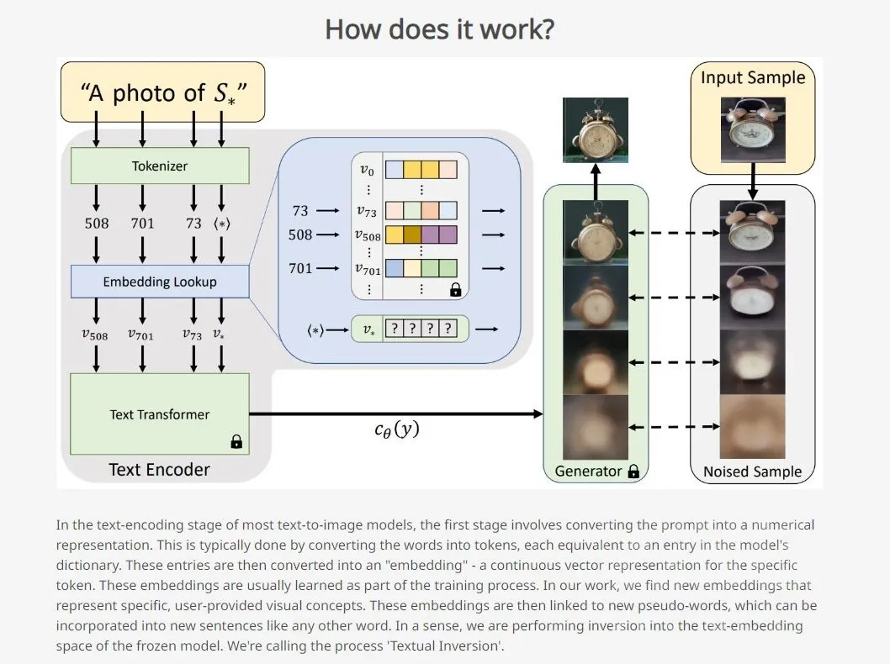

# Textual Inversion

[官方 Wiki](https://github.com/AUTOMATIC1111/stable-diffusion-webui/wiki/Textual-Inversion#training-embeddings)

::: tip
训练时请不要加载 VAE。

在启动 webui 前把 "xxx.vae.pt" 重命名为 "xxx.vae.pt.disabled" 或其他名字。

在设置内勾选 **Move VAE and CLIP to RAM when training hypernetwork. Saves VRAM.** 的效果是将 VAE 模型从显存转移到内存，而非卸载，
:::

{width=1058 height=790 loading=lazy}

## Apt/DreamArtist

TI 是让 AI 了解 “喜欢” ，而 Apt 让 AI 了解“喜欢”和“不喜欢”。

所以是一种高效的 Textual Inversion

https://github.com/7eu7d7/DreamArtist-sd-webui-extension

[论文地址](https://arxiv.org/abs/2211.11337)

### 简单的小指南

#### DL（APT）准备

1. 关闭 `--xformers`
2. 设置 Clip skip 调为 1

#### 参数

1. 正向，反向词元 token 对比值设定（因人物复杂度由低到高 `(3,6)(4,6)(5,7)(3,10)`)
2. 学习率 `LR(0.0025,0.003)` 作者范例使用 `0.003`
3. `CGF = 3`
4. 宽高比 `512:512`
5. 迭代步数 `step = 8000 (LR = 0.003)`
6. 更新后的实验性功能 EMA（正）/EMA（负） 设为 `0.97`

#### 提示

如果生成动漫图片，模型使用 `animefull-latest 7g` 模型，生成可以用 `anything`

> by DreamArtist s author

## 准备数据集

数据集应保证风格一致，内容具有同一概念。如果算力允许，图片越多越好。数据内容可以是插画，抽象画作，也可以是表情包。

对数据集质量要求高，如果背景出现人影等物体，就会训练进去。训练程序非常敏感。

## 要求

显存至少 6GB，舒适使用需要 12GB 显存。根据实验数据，8GB 显存应该选择 `512x512` 分辨率；不推荐 `--lowvram` 和 `--medvram` 参数下进行训练。

如果你有足够的 VRAM，那么使用 `--no-half --precision full` 可能会防止溢出带来的问题。

你可以中断和恢复训练，但是 optimizer state 不会被保存，所以不推荐这样做。

## 设置说明

准备 30 张以上的目标人设图片，每一张图片应当裁剪为同样的比例。（ webui 已经支持了长方形图片的裁剪）

在 `Interrogate Options` 设置中，`Interrogate: deepbooru score threshold` 是 deepdanbooru (从图像提取标签的一个模型) 标签置信度阀值。建议使用 0.75，也就是保留置信度大于 0.75 的结果。

比如，假定识别结果为：

```text
1.000 1girl
0.986 blush
0.981 long_hair
0.980 solo
0.918 japanese_clothes
0.912 rating:safe
0.798 bangs
0.795 wide_sleeves
0.731 blunt_bangs
0.637 long_sleeves
0.628 monochrome
```

就会丢弃 `wide_sleeves` 以下的内容。

`Interrogate: deepbooru sort alphabetically` 是按照字母顺序排序 Tag，因为 Tag 对结果影响很大，所以我们取消勾选此项。

`use spaces for tags in deepbooru` 应当开启。

`escape (\) brackets in deepbooru (so they are used as literal brackets and not for emphasis)` 应当开启。

按下 `Apply setting` 保存设置。

## 创建训练

打开 `train` 选项卡，在 `Create embedding`选项卡新建一个 `embedding` 模型。

`Number of vectors per token` 是 embedding 的宽度，与数据集有关，如果少于 百张，可以设置 3。

宽度越大时效果越强，但是需要数万轮训练。据 [usim-U](https://space.bilibili.com/99162407) 的视频，设置 24 至少需要三百张高质量作品。

`Name` 输入框输入你预想的出现此人设的 提示词。

`Initialization text` 可以输入 `one girl` 这种大分类，只能填一个，人物可以是 1girl 或者 1boy，或者画风。

`Number of vectors per token` 是此 `embedding` 要占据的 token 位数量，越多越好，但是相应也会减少其他提示词 token 的位置。

新建，会创建一个在 `embedding` 下的 pt 文件。

## 预处理

打开 `Preprocess images` 选项卡。

`Source directory` 中填入你的训练用图片文件夹目录，里面只允许有训练图片。

`Destination directory` 中填入预处理完毕后图片保存路径。

选择训练的图片大小，一般 8Gb 显卡使用 `512x512` ，尺寸越大不一定越好。

**接下来有四个复选框**

-   `Create flipped copies`  
    勾选后会将图片镜像反转来增加数据量。
-   `Use deepbooru caption as filename`  
    深度学习识 Tag，勾选后可以训练适用于 NAI 的 `embedding`。 如果你没有这个选项，需要在启动项添加`--deepdanbooru`  
    Windows 需要在 `webui-user.bat` 的 `COMMANDLINE_ARGS=` 一行添加，或者直接 `python launch.py --deepdanbooru` 。（如果启动卡住是网络问题）
-   `Use BLIP for caption`  
    使用 BLIP 模型为文件名添加标题。不太适合二次元图片。
-   `Split oversized images into two`  
    将超大图像一分为二，一般不用。  
    所以我们勾选 `Use deepbooru caption as filename` 和 `Create flipped copies`。  
    点击按钮，等待处理结束。

## 训练

训练是一个动态的过程！

在 `Train` 子选项卡中，选择你要训练的模型。

### 学习率

`Learning rate` (超参数：学习率)，学习速率代表了神经网络中随时间推移，信息累积的速度，这个参数较大地影响了影响训练的速度。

通常，Learning rate 越低学习越慢（花费更长的时间收敛），但是效果一般更好。

一般设置为 0.005，如果想快一些，可以使用 0.01 加快。但是如果设置得太高，梯度下降时候步长太大无法收敛，会且可能会破坏 `embedding`，使得效果达不到预期。如果设置的太小，容易陷入局部最优。目前 TI 支持设置 `0.1:500, 0.01:1000, 0.001:10000` 的学习率，它会按照 `学习率:步数` 进行，如果步数为小数，则代表 `总步数*百分比`。

训练时，可以先用较大的学习率进行测试，然后逐步调小 `0.1 -- 0.02 -- 0.005` ，每次测试都用上一次效果最好的。

{width=1506 height=675 loading=lazy}

### 其他参数

`Log directory` 是日志目录

`Prompt template file` 是带有提示的文本文件，每行一个，用于训练模型。

目录中 `textual_inversion_templates`，解释了你可以使用这些文件做什么。

训练时参考 `style.txt` 和 `subject.txt`，比如训练画风，使用 `style.txt`，训练人物、物体，使用 `subject.txt`

根据模板文件，你可以在文件名中使用下面的关键词，处理时它们会被替换。

```
[name]:  embedding 的名称
[filewords]: 数据集中图像文件的名字
```

### 操作

-   `Preview prompt`  
    预览，完成后用此提示词生成一张预览。  
    如果为空，将使用来自 prompt 的提示。
-   `Save a copy of embedding to log directory every N steps, 0 to disable`  
    每 N 步将嵌入的副本保存到日志目录，0 表示禁用。
-   `Save an image to log directory every N steps, 0 to disable`  
    每 N 步保存一个图像到日志目录，0 表示禁用。

### 步数

`Max steps` 决定完成多少 `step` 后，训练将停止。

一个 step 是向模型训练一张图片（或一批图片，但目前不支持批量）并用于改进 embedding。如果你中断训练并在以后恢复训练，步数会被保留。

角色形象的风格化模型，建议步数为 15000-40000

画师画风的风格化模型，建议步数为 40000-80000

::: tip
这里给出的是一个参考，实际上 5000 和 7000 也有人成功。

关键在于 Loss 率，Loss 10 轮不降低就可以停止了。

如果 Loss 大于 0.3 ，效果就不是很好
:::

如果太多会过拟合(可以理解为 AI 的死板)，请随时观察，如果过拟合，可以停止。如果效果不是很好，可以去找早些时候的模型继续训练。**不断调整**找到一个好的效果。

`Save images with embedding in PNG chunks` 是生成一个图片形式的 pt 文件，很方便我们分享嵌入，且其相较于 pt 文件更为安全。~~人物卡~~

一切妥当之后，点击右下角 `训练` ，等待。

训练完毕。如果卸载了 VAE ，将 VAE 权重文件重命名回去，重启程序。

## 其他解释

**[filewords]**

这个是代表替换提示词模板文件的 `[filewords]` 为数据集文件的名字，可以实现把 **文件名插入提示词**

1. 默认情况下，文件的扩展名以及-文件名开头的所有数字和破折号都会被删除。

所以这个文件名：`000001-1-a man in suit.png`将成为提示文本：`a man in suit`。文件名中文本的格式保持不变。

2. 可以使用 `Filename word regex` 和 `Filename join string` 选项更改文件名中的文本。

例如，使用单词 `regex =\w+` 和 连接字符串 = `,` ，上面的文件将生成以下文本：`a, man, in, suit`。

正则表达式会从文本提取提示词
`['a', 'man', 'in', 'suit', ]`

并将连接字符串（'，'）放在这些单词之间以创建一个文本`a, man, in, suit`

也可以创建一个与图像具有相同文件名的文本文件 (000001-1-a man in suit.txt) ，然后将提示文本放在那里。将不使用文件名和正则表达式选项。

**Move VAE and CLIP from VRAM when training. Saves VRAM.**

训练时从 VRAM 中卸载 VAE 和 CLIP

设置选项卡上的此选项允许您以较慢的预览图片生成为代价节省一些内存。

训练的结果是一个 .pt 或一个 .bin 文件（前者是原作者使用的格式，后者适用于 huggingface diffusers）

## subject_filewords.txt 模板

[is_textual_inversion_salvageable](https://www.reddit.com/r/sdforall/comments/ykerg2/is_textual_inversion_salvageable/)

Textual Inversion 训练不能训练模型中没有的东西。它对训练照片也非常敏感。

如果你没有得到好的结果（未能收敛或结果崩坏），你需要更换训练数据或者使用 Dreambooth。

那么，训练是如何进行的呢？

被送入模型的向量是训练向量+提示向量。你给它提供一个提示，提示转化为一堆向量并输入模型，输出与训练图片进行比较，被训练的词向量被稍微修正。这个过程在训练中会反复进行。

因为训练向量的修正不会使用提示向量提供的内容进行训练。所以文件词不应该包含属于被训练内容的特性。

如果你有，比如说一个在所有照片中都穿着 `black t-shirt` 的主体，你可以通过在这些图片的 `filewords` 中加入 `black t-shirt` 来有效地将其从训练集中否定掉。

除非你试图修复照片，否则请将 `filewords` 用于 style，而不是用于 subject。

[av559085039 - 【AI 绘画】AI 不认识人物怎么办！强大的 Textual Inversion【NovelAI】 @ Bilibili](https://www.bilibili.com/video/av559085039)

[官方 Wiki](https://github.com/AUTOMATIC1111/stable-diffusion-webui/wiki/Textual-Inversion#training-embeddings)
