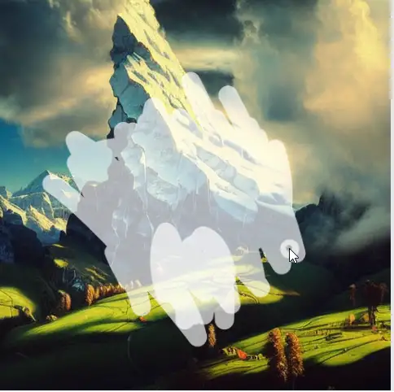
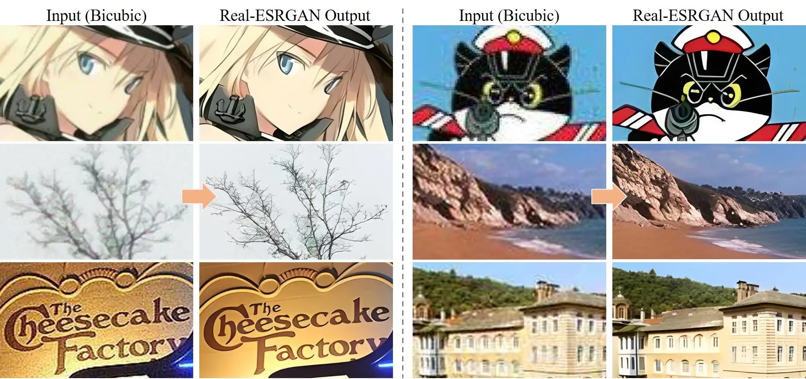
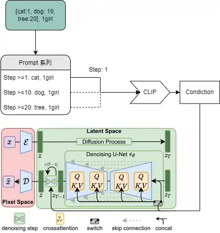

# 魔法进阶

调参基本原理模糊的说是：限定好的数据范围内相似样本越多，越稳定。

## Img2Txt

生成按钮下有一个 `Interrogate CLIP`，点击后会下载 `CLIP`，用于生成当前图片框内图片的 Tag 并填充到提示词。

CLIP 询问器有两个部分：一个是 BLIP 模型，它从图片中创建文本描述。另一种是 CLIP 模型，它会从列表中挑选出与图片相关的几行

::: tip 
本文件为 [model_base_caption_capfilt_large.pth](https://storage.googleapis.com/sfr-vision-language-research/BLIP/models/model_base_caption_capfilt_large.pth)

大小为 855MB
:::

## Img2Img 介绍

一般我们有两种途径对图像进行修复：**PS 和 InPaint**，使用方法也十分多样。

WebUi 使用 `--gradio-img2img-tool color-sketch` 启动会带入一个插件对图片进行颜色涂抹(这里不是 Inpaint)

::: tip 不同之处
PS 重新绘画投入 Img2Img 的话，会导致画风的变动，而 Inpaint 就不会。
:::

### 图形参数

Just resize : 将图像调整为目标分辨率。除非高度和宽度完全匹配，否则图片会被挤压

Crop and resize：调整图像大小，使整个目标分辨率都被图像填充。裁剪多余部分。

Resize and fill：调整图像大小，使整个图像在目标分辨率内。用图像的颜色填充空白区域。

## Img2Img 三渲二

调整 3D 模型骨架比寻找样图更容易。

可以结合 **3D建模** 摆 Pose，也可以使用 MMD 相关软件。

如果是真人图片，需要适当提高 `CFG Scale` 相似度，结合提示词一起生成。降噪 `Denoising` 越高，相关性越低。

推荐使用 [DAZ](https://www.daz3d.com/get_studio) 或者 [Blender](https://www.blender.org/) 或者 Unity ，在对 3D 模型的测试中，**色彩主要影响 AI 的绘画效果**，所以你的模型需要有纹理。

如果你使用 Blender ，你可以使用 [这个视频](https://youtu.be/MClbPwu-75o) 分享的 [模型娃娃](https://www.artstation.com/marketplace/p/VOAyv/stable-diffusion-3d-posable-manekin-doll?utm_source=artstation&utm_medium=referral&utm_campaign=homepage&utm_term=marketplace)

## Img2Img PS重绘画/嫁接修复/躺姿补全

**尺寸上应该尽量靠近原图尺寸，然后选择 `Crop and resize` 也就是裁切后调整大小**

使用PS软件增删元素，然后重新生产。这可以解决画手的问题。

Ai 也接受其他成图进行嫁接(解决躺姿没有下半身的问题)

比如我们可以通过 PS 给角色移植一个手让Ai来润色它，或者为没有下半身的半身像嫁接其他作品的下半身让 AI 润色它。

或者涂鸦特定部位指定形状动作(比如衣料的覆盖率或者形状)，打上色块（为了防止出现阴影，**请取亮色皮肤**）。


> [一张图片](https://m.weibo.cn/status/4823585938735546)展现 WebUI 下 img2img 中不同参数下效果的详细对比图（prompt、steps、scale、各种seed等参数均保持一致）

纵轴是 Denoising strength（线上版的 strength），横轴是Variation strength

### 重绘画/去除/替换

- 首先要对人物描线，然后打上色块（如果有阴影，取**亮色皮肤**）。

- 变动强度，选择较低的 0.3 左右的去噪。

- 然后使用 Img2Img Inpaint + 相关提示词修复，不满意可以再改，直到满意。

- 然后对图像进行超分，降噪(去除图像纹理)。

## Inpainting 修补

在 img2img 选项卡中，在图像的一部分上绘制蒙版，该部分将被重画。

对于 `Masked content` 设置，遮罩内容字段确定内容在修复之前放置到遮罩区域中。

一般选 `original`，可以保持潛空间一致性。

它们的效果如下:

| mask  | fill  | original   | latent noise      | latent nothing       |
|---------------------------|----------------|-----------------------|-------------------------|-----------------------|
|  |  |  |  |  |

`mask` 横条决定了涂抹区块边缘的平滑程度。original 指代 `原图`，fill 是 `填充底色`。

::: tip 
`fill` 要更多 step 才能消除不自然感.
:::

`Inpaint at full resolution` 即全分辨率修复。
通常，Inpaint 会将图像大小调整为*UI中指定的目标分辨率*。启用完全分辨率的Inpaint后，仅调整遮罩区域的大小，并在处理后将其**粘贴回**原始图片。这允许您处理大图片，并允许您以更大的分辨率渲染修复对象。

有几种方法进行重绘制:

- 在网络编辑器中自己绘制蒙版（`Inpaint masked `指重画涂鸦区域，`Inpaint not masked` 指重画涂鸦之外的区域）
- 在外部编辑器中擦除部分图片并上传透明图片。 任何稍微透明的区域都将成为蒙版的一部分。 请注意，某些编辑器默认将完全透明的区域保存为黑色。
- 将模式（图片右下角）更改为"Upload mask"并为蒙版选择单独的黑白图像(white=inpaint)。

如果 `inpaint at full resolution` 出现黑块，可能是内存不足，尝试卸载 vae.


[开源调研-AI绘画全参数讲解-002img2img图像到图像](https://www.bilibili.com/video/BV1HK411Q7uk/?zw)

通过这种方法，我们可以更改角色衣物风格或者其他任何细节。

[如何教会Ai画手](https://www.bilibili.com/video/av559044202/?zw)

## Outpainting 外部修补

Outpainting 扩展原始图像并修复创建的空白空间。
您可以在底部的 img2img 选项卡中找到该功能，在 Script -> Poor man's outpainting 下。

> Outpainting, unlike normal image generation, seems to profit very much from large step count. A recipe for a good outpainting is a good prompt that matches the picture, sliders for denoising and CFG scale set to max, and step count of 50 to 100 with Euler ancestral or DPM2 ancestral samplers.

## Img2Img Loopback 回环生成

在 img2img 中设置 loopback 脚本，它允许自动将输出图像设为下一批的输入图像。

Batch 数设置控制获得多少次迭代

通常，在执行此操作时，您需要自己为下一次迭代选择许多图像中的一个，因此此功能的有用性可能值得怀疑，但反正我已经设法获得了一些我无法获得的非常好的输出。

## Img2Img 让低显存生成大分辨率图片

如果遇到生成鬼图或者低显存生产高分辨率图片，可以采用 Img2Img 画质提升脚本。

其实我**强烈推荐**你使用 Extras 的功能对低分辨率进行重放，效果不错的，且体验良好！

### 脚本

但是如果你想使用脚本提供的分辨率增强，这里有 Img2Img 的具体流程

1. 使用 `--medvram` 或者 `--lowvram` 参数启动webui
2. 选择较小分辨率生成图片。记住你生成图片的分辨率。生成完毕之后，复制图片的 `Seed`
3. 生成完毕后，先查看图片效果是否满意。如果满意，直接将图片送进Img2img。（点击 `Send to img2img`）
4. 在img2img界面底部，有一个 `Script` 选项。将 `Script` 选为 `SD Upscale`，里面的 Tile overlap 尽量调小
5. 一般送入 Img2img 的图，输入框自动填充原提示词。如果你发现prompt有变动，请手动填充
6. 选择合适的 `Sampling Steps` 和 `Sampling method`
7. 确认你的 `Width` 和 `Height` 与**原图**一致
8. 将第 2 步复制的 Seed 填入img2img的 Seed 里并生成

这里的 Width 和 Height 是超分时 img2img 的图片大小，如果不等会导致出现重叠问题

SD Upscale 选项在 Img2Img 的 Script 栏目中，主要作用是提升分辨率。

[脚本解决方案来源于此](https://gist.github.com/crosstyan/f912612f4c26e298feec4a2924c41d99#%E9%AB%98%E5%88%86%E8%BE%A8%E7%8E%87%E4%B8%8B%E5%87%BA%E6%80%AA%E5%9B%BE)

### 附加功能 Extras

SD-WebUI 的 Extras 页有一个自带的超分功能，可以使用 `ESRGAN_4x` 模型提升图片分辨率。

当然 `RealESRGAN` 或者 `RealCUGAN` 也可以。

::: tip 相关模型
文件统一下载到 `SDwebUI文件夹\models` 下

[LDSR](https://heibox.uni-heidelberg.de/f/578df07c8fc04ffbadf3/?dl=1)，文件大小为1.9GB

[BSGRAN 4x](https://github.com/cszn/KAIR/releases/download/v1.0/BSRGAN.pth) ，文件大小为63.9M

[ESRGAN_4x](https://github.com/cszn/KAIR/releases/download/v1.0/ESRGAN.pth)，文件大小为63.8MB

[ScuNET GAN/PSNR](https://github.com/cszn/KAIR/releases/download/v1.0/scunet_color_real_gan.pth" to D:\stable-diffusio\models\ScuNET\ScuNET.pth)，文件大小为68.6MB

[SwinIR 4x](https://github.com/JingyunLiang/SwinIR/releases/download/v0.0/003_realSR_BSRGAN_DFOWMFC_s64w8_SwinIR-L_x4_GAN.pth)，文件大小为136MB
:::

**Highres Fix/超分应该使用什么 Upscaler？**

`SD Upscaler` 在注重细节的同时还提升分辨率。

曾经有段时间，`LSDR` 被认为是最好的。有些人喜欢 swinir，有些喜欢`esrgan4x`，`ymmv`，推荐使用 `ESRGAN_4x`

如果你要搞二次元，推荐使用[realcugan](https://github.com/bilibili/ailab/tree/main/Real-CUGAN)


## 图像去噪

推荐使用 [Real-ESRGAN](https://github.com/xinntao/Real-ESRGAN) 降噪。



>效果图

## 渐变提示词

详见 [Prompt Editing](https://github.com/AUTOMATIC1111/stable-diffusion-webui/wiki/Features#prompt-editing)

允许您开始对一张图片进行采样，但在中间切换到其他图片。基本语法是：

```
[from:to:when]
```

其中from和to是任意文本，并且when是一个数字，用于定义应在采样周期多长时间内进行切换。越晚，模型绘制to文本代替from文本的能力就越小。如果when是介于 0 和 1 之间的数字，则它是进行切换之后的步数的一小部分。如果它是一个大于零的整数，那么这只是进行切换的步骤。

将一个提示编辑嵌套在另一个提示中不起作用。

**使用方法**

[to:when] 在固定数量的step后添加to到提示 ( when)

[from::when] 在固定数量的step后从提示中删除from( when)

例子： a [fantasy:cyberpunk:16] landscape

开始时，模型将绘制 `a fantasy landscape`。

在第 16 步之后，它将切换到绘图 `a cyberpunk landscape`，从幻想停止的地方继续。

比如 [male:female:0.0], 意味着你开始时就要求画一个女性。

## 注意 `尺寸`

比如出图尺寸宽了人可能会多

::: tip
要匹配好姿势，镜头和人物才不畸形，有时候需要限定量词，多人物时要处理空间关系和 prompt 遮挡优先级。人数->人物样貌->环境样式->人物状态
::: 

## 提示词原理

咒语的科学原理。



> By RcINS

在程序中，提示词的解析由 CLIP 处理

渐变等功能主要由 [WebUI 的提示词预处理模块](https://github.com/AUTOMATIC1111/stable-diffusion-webui/blob/master/modules/prompt_parser.py) 实现。

CLIP 无法直接处理中文，中文字符会被分解。

**关于权重的实现**：权重增加通常会占一个提示词位。

**关于渐变的实现**：到了指定 Step ，WebUI 程序会替换对应 提示词，达到渐变效果。

其他以此类推。

WebUI prompt 语法会进行相应预处理，然后通过 Embedding 模型并交给后续模型处理。
