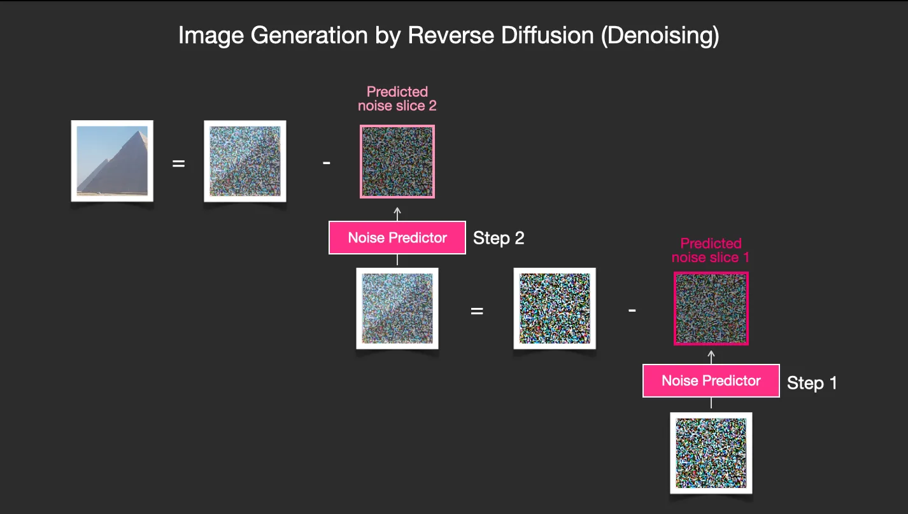

# 魔法入门

请先通过前文 [调参基础](../../guide/configuration/param-basic.md) 了解 SD-WebUI 网页应用提供的基本参数。

## 如何书写提示词

这是一个通用的指南，内容是基本通用的，可能有例外情况，请读对应的章节了解不同应用的特性。

### 词汇

单词可以由一个或多个符号组成。常用词通常被解析为具有共同含义或少量含义的单个标记。拼写错误和不常见的单词被解析为多个标记，这些标记从各种不同的单词中获得含义，并且通常是不一致的含义。

元音的变化更有可能将你映射到一个不同的不相关的单词，一个更独特更强的含义和影响。

所以 `bank, bankk bank` 很可能被解析为 `bank` 的近义词。但是 `bonk` 有一个完全不同的意思。

### 大小写

CLIP 的标记器在标记之前将所有单词转为小写。其他模型，如 BERT 和 T5，将大写的单词与非大写的单词区别对待。

### 提示词长度

**避免过长的提示词。**

由于提示词的权重值从前向后递减，放置在特别靠后的提示词已经对图片的实际生成影响甚微。

不堆叠 prompt 是一个好习惯，但是如果你确实有很多内容要写，可以适当提高 step 数量，以便在生成过程中更好地利用提示词。

选项 `Increase coherency by padding from the last comma within n tokens when using more than 75 tokens` 让程序试图通过查找最后 N 个标记中是否有最后一个逗号来缓解这种情况，如果有，则将所有经过该逗号的内容一起移动到下一个集合中。该策略可适当缓解提示词过多无法处理的问题，但可能破坏提示词之间的权重关系。

除了 WebUI ，由于 GPT-3 模型限制，prompt 并不是无限的，positive token 在 75-80 之间，75 字符后的内容会被截断。

### 特殊情况

大写字母并不重要，下划线（"\_"）通常不被转换为空格。

开头和结尾的额外空格会被直接丢弃。词与词之间的额外空格也会被丢弃。

### 自然语言

可以直接使用自然语言，SD-WebUI 有自然语言处理能力(英文句子)，可以使用部分颜文字 (如 `(^_^)`) 和 Emoji，甚至可以是一些日文。部分 Emoji 在表达上尤为准确。

至少有一些 Unicode 字符是拉丁语字符的替代版本，它们被映射为普通的拉丁语字符。日语中使用的全幅拉丁字符（如 ABC）被确认为可以转换。法语重音符（如 é 和 è）和德语 umlauts（如 ä 和 ö）不会被映射到它们的常规对应物。

人类的语言是任意的和不精确的(除了 Emoji ，它只有一个字符所以异常精确)，人类的语言从未进化到可以详细描述空间信息的程度。

许多小白遵循其特定的某些仪式性行为，认为这种模式会增加产生有利结果的机会。这种玄学不仅在实践中不起作用，而且还会继续强化和表现出来，促使一个人在错误的方向上越走越远。

稳定扩散是一个涉及潜伏空间的潜伏扩散模型。但根据定义，潜伏意味着不可观察。换句话说，它是一个黑匣子，没有人真正知道这个空间里到底发生了什么。

### 标点符号

用逗号、句号、甚至是空字符（"/0"）来分隔关键词，可以提高图像质量。目前还不清楚哪种类型的标点符号或哪种组合效果最好。当有疑问时，只要以一种使提示更容易被阅读的方式来做。

### 词汇顺序

[demystifying_prompting_what_you_need_to_know/](https://www.reddit.com/r/StableDiffusion/comments/yjwuls/demystifying_prompting_what_you_need_to_know/)

似乎 VAE 使用了一种称为贝叶斯定理的统计方法。在计算标记的去向时，前几个单词似乎锚定了其余单词标记在潜在空间中的分布。

早期的标记具有更一致的位置，因此神经网络更容易预测它们的相关性。在贝叶斯推理中，矩阵中的第一个标记或证据很重要，因为它设置了初始概率条件。但是后面的元素只是修改了概率条件。因此，至少在理论上，最后的令牌不应该比前面的令牌具有更大的影响。

但是解析器理解事物的方式是不透明的，因此没有办法**确切**地知道词法顺序是否具有“锚”效应。

### 运动和姿势

如果没有很大要求的话，选择只与少数姿势相关的提示。

这里的姿势是指某一事物的物理配置：图像主体相对于摄像机的位置和旋转，人类/机器人关节的角度，果冻块被压缩的方式，等等。你试图指定的事物中的差异越小，模型就越容易学习。

因为运动就其定义而言涉及到主体姿势的巨大变化，与运动相关的提示经常导致身体的扭曲，如重复的四肢。另外，因为人类的四肢，特别是人类的手和脚有很多关节，他们可以采取许多不同的、复杂的姿势。这使得他们的可视化特别难学，对于人类和神经网络都是如此。

简而言之：人类站着/坐着的好形象很容易，人类跳着/跑着的好形象很难。

### 特异性

问题体现在语义偏移上。对于神经网络的训练来说，特征的质量很重要：输入和输出之间的联系越强，神经网络就越容易学习这种联系。

换句话说，如果一个关键词有非常具体的含义，那么学习它与图像之间的联系要比一个关键词有非常广泛的含义容易得多。

这样一来，即使是像 "Zettai Ryouiki" 这样很少使用的关键词也能产生非常好的结果，因为它只在非常具体的情况下使用。另一方面，"动漫" 即使是一个比较常见的词，也不会产生很好的结果，这可能是因为它被用于许多不同的情况，即使是没有字面意思的动漫。如果你想控制你的图片的内容，选择具体的关键词尤其重要。另外：你的措辞越不抽象越好。如果可能的话，避免留下解释空间的措辞，或需要 "理解" 不属于图像的东西。甚至像 "大" 或 "小" 这样的概念也是有问题的，因为它们与物体离相机近或远是无法区分的。理想情况下，使用有很大可能逐字出现在你想要的图像标题上的措辞。

::: tip
提示词是提示而不是判定依据，比如你输入质量判定词汇的时候，其实是在限制数据的范围，而不是 “要求” AI 出一张很好的图片。
:::

### 书写格式

可选的，为了方便书写改动，可采取多行提示词的书写方式。其中一种格式如下：

```text
masterpiece,
1girl,  hatsune miku,
look at viewer,turning back,
blow wind, cyan hair, two side up, cyan eyes,eardrop,dress,
caustics, masterpiece, high resolution,
```

第一行指定作品风格类型，第二行指定人物，第三行指定动作，第四行指定场景和着装，第五放指定其他参数

以上顺序已经比较合理，但是你也可以调整提示词的顺序以产生不同的结果。 你可以手动调整，也可以 [使用 X/Y 图自动生成各种顺序](https://github.com/AUTOMATIC1111/stable-diffusion-webui/pull/1607)。

据称，模型难以解析下划线，请将它们替换为空格。

### 调整提示词顺序

提示词放入的顺序就是优先级。

SD-WebUI 突破最多 75 个词组限制的方式是将每 20 + 55 个词分为一组。

出于提高可读性的目的，推荐主体往前放，接着描述装扮的词，画质提升词穿插在这些描述词之间，一般为了提高成品率要把动作、NSFW 词等改变构图的词往后放，或者手动调低权重。

以上排序对于每组提示词单独计算，因此需要合理调整顺序。

{width=1426 height=808 loading=lazy}

> https://jalammar.github.io/illustrated-stable-diffusion/

### 语义失衡

每一个提示词就像染料一样，它们的 “亲和性“ 不同，如果更常见的提示词，比如 `loli` (和其他提示词并列放置)的影响就大于其他提示词。

比如，如果你想生成动漫图片，使用了 星空 `startrail` 标签，相比你期望出现的动漫星空，会有更多来自真实照片的星空元素。

许多词汇在基准上的权重就不一样，所以要根据效果进行合理调节。

## 否定提示词

SD-WebUI 网页应用会在生成时 **避免生成否定提示词提及的内容**。

否定提示是一种使用 Stable-Diffusion 的方式，允许用户指定他不想看到的内容，而不对模型本身做额外的要求。

通过指定 `unconditional_conditioning` 参数，在生成中采样器会查看去噪后符合提示的图像（城堡）和去噪后看起来符合负面提示的图像（颗粒状、雾状）之间的差异，并尝试将最终结果远离否定提示词。

```python
# prompts = ["a castle in a forest"]
# negative_prompts = ["grainy, fog"]

c = model.get_learned_conditioning(prompts)
uc = model.get_learned_conditioning(negative_prompts)

samples_ddim, _ = sampler.sample(conditioning=c, unconditional_conditioning=uc, [...])
```

比如使用以下提示词避免生成水印和文字内容

```text
lowres, bad anatomy, bad hands, text, error, missing fingers,
extra digit, fewer digits, cropped, worst quality, low quality,
normal quality, jpeg artifacts, signature, watermark, username, blurry
```

还如这个例子

```text
ugly, fat, obese, chubby, (((deformed))), [blurry], bad anatomy,
disfigured, poorly drawn face, mutation, mutated, (extra_limb),
(ugly), (poorly drawn hands fingers), messy drawing, morbid,
mutilated, tranny, trans, trannsexual, [out of frame], (bad proportions),
(poorly drawn body), (poorly drawn legs), worst quality, low quality,
normal quality, text, censored, gown, latex, pencil
```

更多资料详见 [官方 Wiki](https://github.com/AUTOMATIC1111/stable-diffusion-webui/wiki/Negative-prompt#examples)

## 权重系数

权重系数可改变提示词特定部分的比重。

更多资料详见：[Wiki:Attention Emphasis](https://github.com/AUTOMATIC1111/stable-diffusion-webui/wiki/Features#attentionemphasis)

具体规则如下（适用于 SD-WebUI）

```
a (word) - 将权重提高 1.1 倍
a ((word)) - 将权重提高 1.21 倍（= 1.1 * 1.1），乘法的关系。
a [word] - 将权重减少 1.1 倍
a (word:1.5) - 将权重提高 1.5 倍
a (word:0.25) - 将权重减少 4 倍 (= 1 / 0.25)
a \(word\) - 在提示中使用文字 () 字符
```

必须使用 `()`指定，可以像这样指定权重：(text:1.4)

如果未指定权重，则假定为 `1.1`

指定权重仅适用于 `()` 而不是 `[]`，注意 `[]` 为权重削减语法，指定单个权重仅适用于 WebUI 且使用 `()`

```
> ( n ) = ( n : 1.1 )
> (( n )) = ( n : 1.21 )
> ((( n ))) = ( n : 1.331 )
> (((( n )))) = ( n : 1.4641 )
> ((((( n )))) = ( n : 1.61051 )
> (((((( n )))))) = ( n : 1.771561 )
```

::: info
权重增加通常会占一个提示词位，应当避免加特别多括号。

过多圆括号会导致 字符 被程序吃掉，`a ((((farm))), daytime`会变成 `a farm daytime` 而没有逗号。
:::

::: tip 关于 NovelAI
NovelAI 中不允许单独指定权重，但支持混合权重 `cat:1|happy:-0.2|cute:-0:3` 这样的语法。

因为 NAI 使用的是 WebUI 2022 年 9 月 29 日之前的实现，所以权重增强语法是旧的 `{}` ，新的 WebUI 更改为 `()`。

**换算关系**

NAI 的 `[word]` = WebUI 的 `(word:0.952)` (0.952 = 1/1.05)

NAI 的 `{word}` = WebUI 的 `(word:1.05)`

NAI 花括号权重为 1.05/个，WebUI 圆括号权重为 1.1/个。
:::

::: tip How It Works
每个单词都将被解析为 768 维度空间内的一个向量，该向量“指向”概念的方向。

如果你缩放这个向量，这个概念会变得更强或更弱。

详见 [Here](https://github.com/AUTOMATIC1111/stable-diffusion-webui/discussions/2905)
:::

无论使用何种具体的脚本，重复某个关键词似乎都会增加其效果。

值得注意的是，你的提示中存在越多的标记，任何单一标记的影响就越小。你还会注意到，由于这个原因，在增加新的标记时，风格会逐渐消失。强烈建议随着提示符长度的增加增加风格词的标记强度，以便保持一致的风格。

## 提示词语法

NovelAI 用户可参照 [官网文档](https://docs.novelai.net/)。

### 表示方法

分隔：英文半角 `,` 做分隔符，在英文逗号前后存在一个或数个空格并不影响实际使用。

权重修改：SD-WebUI 可使用 `()` `[]` 嵌套的方式以每括号 1.10 倍系数对权重值进行修正，或通过 `(提示词:权重值)` 修改单个提示词的权重，权重值范围是 `0.1 ~:100`，允许小数。NovelAI 不提供直接数字指定权重的方法，但可以通过 `{}` 与 `[]` 嵌套的方式以每括号 1.05 倍系数对权重值进行修正。详见 [权重系数](#权重系数)。

::: tip
NovelAI 类后端与 SD-WebUI 类后端的提示词语法 **不通用**。

SD-WebUI 使用 `()` 增强权重，而 NovelAI 使用 `{}` 增强权重。两者对于权重值的修改亦不同。

注意 NovelAI 不支持通过数字直接指定权重。

如果你想便捷转换权重，可以使用 [Telegram 上的括号转换机器人](https://t.me/M2NM2NBot)
:::

::: warning
`a ((((farm))), daytime` 的语法可能会吃掉逗号
:::

混合：NovelAI 使用 `|` 分隔多个关键词以混合多个要素，字面意义上的混合，可以串联多个提示词。SD-WebUI 使用 `AND` 关键词（注意大小写）。混合组内单词可通过 `提示词 :权重值` 格式指示权重值。

::: warning
值得注意的是，`AND` 会将所有标签划分成段，括号对其并无作用。
:::

[渐变](advanced#渐变提示词)：使用 `[some1:some2:num]`

-   `[fantasy:cyberpunk:0.2]` 代表从 20% 的生成步数后，将 `fantasy` 标签替换为 `cyberpunk`
-   `[fantasy:cyberpunk:16]` 代表从第 16 步后，将 `fantasy` 标签替换为 `cyberpunk`
-   `[to:when]` 在 when 指示的生成步数后添加 `to` 到提示词中
-   `[from::when]` 在 when 指示的生成步数从提示中删除 `from` 提示词

转义：SD-WebUI 中如果提示词本身带有括号，如 `pig (animal)` 请在括号前使用 `\` 字符转义作 `pig \(animal\)`，避免出现意料之外的增强效果。

交替（[Alternate prompt](https://github.com/AUTOMATIC1111/stable-diffusion-webui/pull/1733)）：混合机。这使您可以创建动物、人或风格的混合体，每生成一步即在列表中轮转切换一个提示词(一步一换)，轮回渲染。例如 `[alison brie|emma stone|elizabeth olsen|scarlett johansson|anne hathaway|emma roberts], still film`。该语法为 SD-WebUI 专有。

## 风格化

NovelAI 出图风格受训练数据多样性影响并不固定。你可以通过训练风格模型，指定风格关键词等方法来创作带有特效或指定画风的图片。

参考资料：

[NovelAI 使用教程和魔咒课堂](https://space.bilibili.com/8612008/channel/collectiondetail?sid=787691)

[人偶教室的测试记录](https://www.yuque.com/longyuye/lmgcwy)

[风格化: 32 种](https://www.bilibili.com/video/BV1TP411N71t/)

更全面的指南见页尾。

## Batch Count 与 Batch Size

`Batch Count` 指定共生成几个批次。

`Batch Size` 指定每个批次并行生产多少张图片。

批次之间属于串行关系，批次之间的图片并行生成。

对于显存极大的显卡而言，一次生成一张图片无法充分利用显卡计算容量，此时可将 `Batch Size` 提高以充分压榨算力。

### 标签契合度与降噪强度

#### CFG Scale 标签契合度

`cfg scale` 是图像与 prompt 的契合度，该值越高，提示词对最终生成结果的影响越大，契合度越高。

#### Denoising strength 降噪强度

`Denoising strength` 仅在 img2img 时被应用，其表征最后生成图片对原始输入图像内容的变化程度。通过调整该值，可以降低对画风的影响，但也会弱化 img2img 能力。值越高 AI 对原图的参考程度就越低 (同时增加迭代次数)。

对于以图做图来说，低 `denoising` 意味着修正原图，高 `denoising` 就和原图就没有大的相关性了。一般来讲阈值是 0.7 左右，超过 0.7 和原图基本上无关，0.3 以下就是稍微改一些。

实际执行中，具体的执行步骤为 Denoising strength \* Sampling Steps。

## 从图片指纹提取提示词

程序默认会在图片中加入提示词，参数，模型信息，对于没有压缩的原图，可以拖入 `PNG Info` 选项卡，查看其内嵌的生成信息。

也可以使用 [在线工具](https://spell.novelai.dev/) 查看它。

## 逆向分析提示词

通过使用其他机器学习模型，可以从图片中提取相关元素。结果常常不准确。

Stable Diffusion WebUI 自带逆向分析提示词功能，需将图片上传至 img2img 窗体后使用 [CLIP Interrogate](advanced#clip-interrogate) 或 [DeepDanbooru Interrogate](advanced#deepdanbooru-interrogate)。

其他方法：

-   [LenKiMo_Bot](https://t.me/LenKiMo_Bot)
-   [DeepDanbooru](https://github.com/KichangKim/DeepDanbooru)

## 提示词组合展示台 / 搜索引擎

你可以访问以下传送门获取一些优秀的参数实例！（当然，中文社区的测试群有 **大量素材**，一分钟 20 次）

[StableDiffusion_Show](https://t.me/StableDiffusion_Show)

[cyan_ai_sese](https://t.me/cyan_ai_sese)

[LEXICA 搜索引擎](https://lexica.art/?q=Miku)

## Prompt matrix 参数矩阵

使用 `|` 分隔多个 Tag，程序将为它们的每个组合生成一个图像。 例如，如果使用 `a busy city street in a modern city|illustration|cinematic lighting` ，则可能有四种组合（始终保留提示的第一部分）：

-   a busy city street in a modern city
-   a busy city street in a modern city, illustration
-   a busy city street in a modern city, cinematic lighting
-   a busy city street in a modern city, illustration, cinematic lighting

## 提示词冲突

比如 `sex` 包含较多姿势体位，在使用者想要特定姿势时，法术内单一的 `sex` tag 就应该被删除。

同样地，`loli` Tag 附带了强画风属性，会很大地影响结果！改成 `female child` 会好一点。

默认我们使用(别人给你的)的消极提示中，有可能会出现会发生冲突的词汇，请务必注意。

## 渐变标签

详见 [Prompt Editing](https://github.com/AUTOMATIC1111/stable-diffusion-webui/wiki/Features#prompt-editing)

允许您开始对一张图片进行采样，但在中间切换到其他图片。基本语法是：

```
[from:to:when]
```

其中 from 和 to 是任意文本，并且 when 是一个数字，用于定义应在采样周期多长时间内进行切换。越晚，模型绘制 to 文本代替 from 文本的能力就越小。如果 when 是介于 0 和 1 之间的数字，则它是进行切换之后的步数的一小部分。如果它是一个大于零的整数，那么这只是进行切换的步骤。

将一个提示编辑嵌套在另一个提示中不起作用。

**使用方法**

[to:when] 在固定数量的 step 后添加 to 到提示 ( when)

[from::when] 在固定数量的 step 后从提示中删除 from( when)

例子： a [fantasy:cyberpunk:16] landscape

开始时，模型将绘制 `a fantasy landscape`。

在第 16 步之后，它将切换到绘图 `a cyberpunk landscape`，从幻想停止的地方继续。

比如 [male:female:0.0], 意味着你开始时就要求画一个女性。
