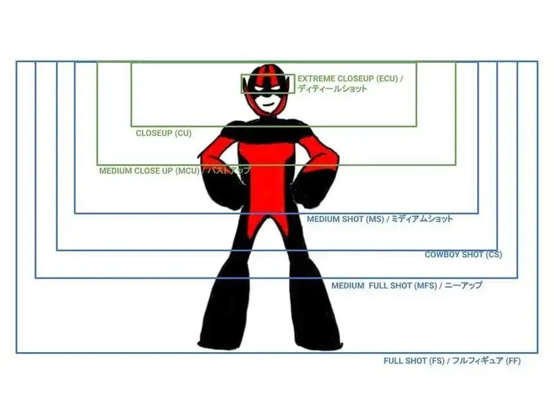
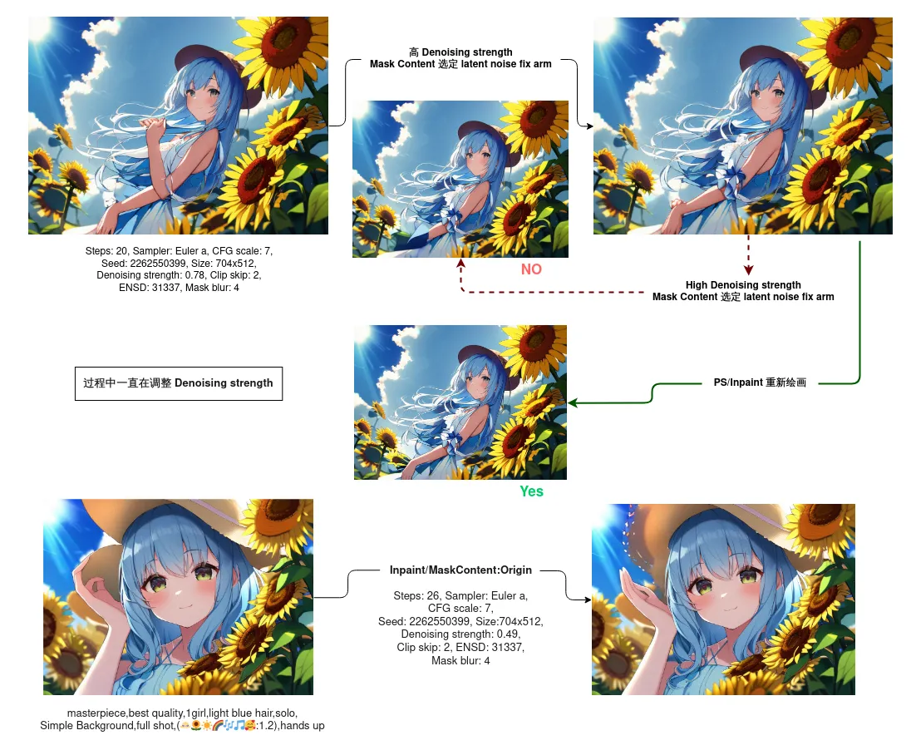
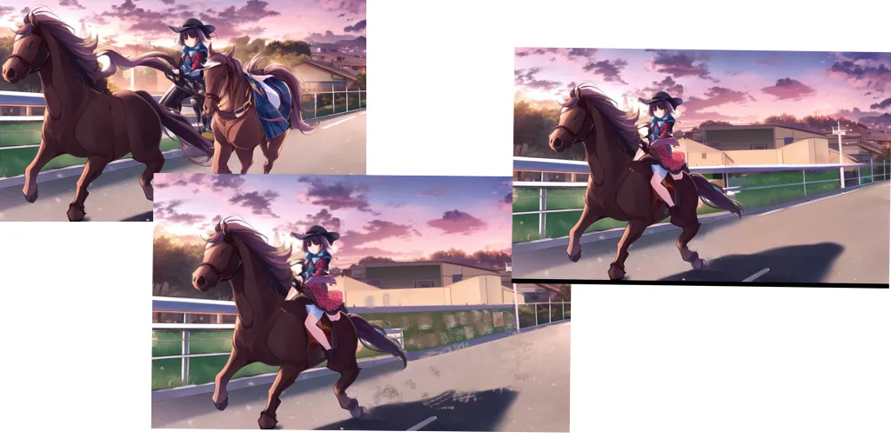
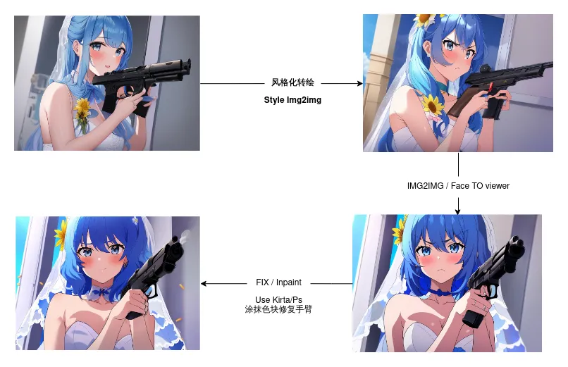
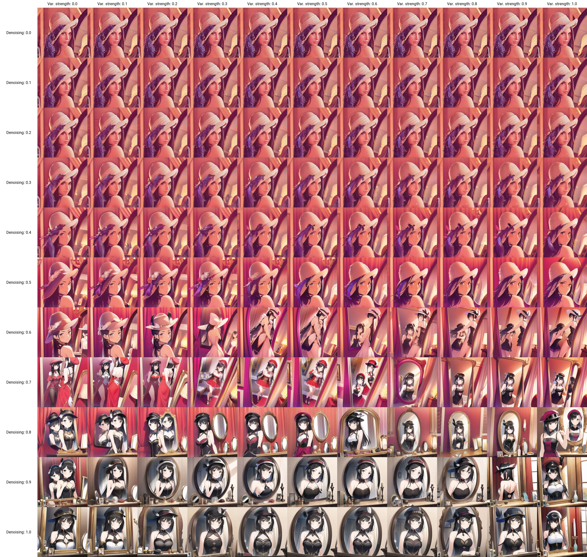

# 实战技巧

这个简短的实战指南，可以让你快速了解如何合理调整参数达成目的效果。

目前，AI 处理不好细节和多人物，如果一个个处理，光影结构就会乱掉。如果修图，不如重画。但是画背景和做预览很实用。

核心逻辑就是缩小预选数据的范围，调节天平在消极和积极提示之间的方向，还有使用部分语法控制提示词效果的强烈程度和起效过程。

## 场景表

竖着看

|人物|场景|数据限定|事件|
|----|------|-----|-----|
|表情| | | |
|头发|广狭选择|绘画类型|缩写词|
|眼睛|光影选择|评价限定|sfw/nsfw|
|衣着|背景主体|联想元素| 出品公司 |
|状态|人物事件地|  3D/2D  |  作品品牌  |
|姿势位|  |  |         |
|镜头位|  |  |         |

## 画作焊接！

通过 [AIPhotoShop-无限外延画布的在线工具](https://www.painthua.com/) ，你可以连续 “焊接” 作品，非常方便。只需要在启动命令加上 `--api` 参数，然后打开网页就可以使用。

[GitHub](https://github.com/BlinkDL/Hua)

> 并不支持在任意模型上进行图像外延，因为它们不是 Inpaint 模型 (Stable Diffusion 有专用的 Inpaint 模型。)

## 遏制风格污染

介绍如何在 WebUI 中生成图片时，将主体作为重点，而不是画风。[^12]

为了得到预期结果，我们将 `style` 改为 `[style:10]` 

Automatic 1111 的 WebUI 提示词语法中，[x:10] 告诉 稳定扩散 直到第十个 step 再渲染这个提示词。

当达到10步的时候，一个基本的图像已经形成了，所以风格化肆意污染主体成分，而是像在现有图像上进行 IMG2IMG(你可以把它看成是Img2img的形式)

你可以根据你所做的整体步骤的多少来试验这个数字。如果你把格式改为 [x:0.2]（即低于1的数字），那么它就变成了百分比，[x:0.6]告诉 SD 等到总步骤数的 60% 时再渲染 x ，以此类推。

## 图转图的秘籍

无论是 3D (DAZ这样的3D模型) 还是线稿，AI 只识别 **色彩** ，而不是线条，色彩直接决定图转图的效果。

## 尺寸选择

不应该将其与画质挂钩，尺寸一定程度上影响了主题，因为它潜在代表选择的类别(比如竖屏人物，横屏风景，小分辨率表情包居多)。

若需提升画质，可采取如 waifu2x 等的成熟技术提升分辨率。

## 视角

[推荐使用 Danbooru 含有的术语](https://danbooru.donmai.us/wiki_pages/tag_group%3Aimage_composition)



> 引用来自日本 Wiki 的图片，作者不明

* `extreme closeup` - ECU
* `close up` - CU
* `medium close up` - MCU
* `medium shot` - MS
* `cowboy shot` - CS
* `medium full shot` - MFS
* `full shot` - FS

## 表情符号

Emoji (💰,💶,💷,💴,💵,🎊,🪅🪄,🎀,👩‍🚀) 表情符号也是可以使用并且 **非常准确** 的，经过我多次测试，Ai 可以认识表情符号。

emoji 因为只有一个字符，所以在语义准确度上表现良好。

[表情符号参考](https://unicode.org/emoji/charts/emoji-list.html)

## 动漫风格

`anime coloring` 会有很好的效果，像动漫截图一样。(如果遇到黑白色，需要指定人物部件的色彩)

[av304175820 - AI绘 | 让你的图片更特别！32种风格化prompt简介 @ Bilibili](https://www.bilibili.com/video/av304175820)

## 优化作品效果

### 对目标进行审视

想一想，自己想要的作品，在互联网上会被打上什么标签呢？

贴纸肯定不会打上 `masterpiece, best quility,` 吧。

另外就是如果要求的是像素作品，应该移除一些冲突的消极提示(如果有的话)。

### 顺序调整

在前面的词汇会锚定画面的色彩分布。什么重要什么放前面。

### 语义偏移防范

为了防止语义偏移，优先考虑 emoji，然后少用不必要的 `with` 一类的复杂语法。

### 彩虹混乱图

如果输出混乱的彩虹色图片，可能是生成分辨率被设置得太低。

### 波浪噪点图

密集的波浪或图案，可能是因为权重设置太高了。

### 抠图？

扣过的图，其余背景都会被处理成黑色。

如果你需要背景，效果一般不是很好，建议填色后再操作。

### 粗糙的噪声

细节不够，人物像米糕一样。需要适当提升 step.

### 保护图片不被分割线切割

消极提示加入

```
comic 2koma 3koma 4koma collage
```

应该可以改善。

## 跨领域术语/奇门遁甲

跨领域术语的核心逻辑就是**缩小指定的数据范围**，从画面内容之外的**平台，领域，事件**上入手来提升效果。

是的！你可以在提示中使用 [Film Glossary](https://www.owlnet.rice.edu/~engl377/film.html)、[FILM GLOSSARY摄影术语](http://userhome.brooklyn.cuny.edu/anthro/jbeatty/COURSES/glossary.htm)、[Cinematic techniques摄影技术](https://en.wikipedia.org/wiki/Category:Cinematic_techniques)，以及绘画术语 (类型) 来控制基本情况。

跨领域！你甚至可以使用各种惊险运动的名词来生产一些特效...比如空降

比如，景深，光圈，构图，拍摄机位，运动元素，[艺术摄影术语表中文介绍](https://gallerix.asia/pedia/photography-glossary/)

**但是** 这种效果可能会带来附加作用:引入你不希望见到的风格(如实景**而不是**而二次元)数据进入图片。把握好量度。适当增加 Step 和 风格提示 来改善.

你还可以使用 **平台名** 来限定数据集的范围，比如 pixiv 之类的词汇。

### 扩展阅读

有用的电影术语 https://en.wikipedia.org/wiki/Category:Cinematic_techniques

镜头类型 https://www.bhphotovideo.com/explora/video/tips-and-solutions/filmmaking-101-camera-shot-types

电视术语  https://en.wikipedia.org/wiki/Category:Television_terminology

摄影类型 https://en.wikipedia.org/wiki/Category:Photography_by_genre

摄影术语 https://zh.wikipedia.org/zh-cn/%E9%AB%98%E9%80%9F%E6%91%84%E5%BD%B1

极限运动 https://en.wikipedia.org/wiki/Extreme_sport https://en.wikipedia.org/wiki/Category:Sports_by_type

构图艺术 https://en.wikipedia.org/wiki/Composition_(visual_arts)

## 迭代草图

详见 [GitHub Discussions 讨论串](https://github.com/AUTOMATIC1111/stable-diffusion-webui/discussions/2473)。

这里讨论一下如何将 **手绘草图** 通过 AI 绘画优化，*注意不是二次元*。

在第一次迭代中，您不需要太多 Steps，CFG 可以非常低（以获得更好的多样化结果），如果不想完全丢失草图，Denoising 应该在 0.3 - 0.4 左右。

在最后的迭代中，增加 Steps 和 Denoising 强度（但不超过 0.8，否则图像将被破坏，尤其是在大于 512*512 时）请参见 [这里](https://github.com/AUTOMATIC1111/stable-diffusion-webui/issues/2213#issuecomment-1274137775)，同时根据需要提高 CFG 和尺寸。

你可以随时修复提示（添加或删除出现的细节）并尝试不同的采样器。

另外，你不应该在初次生成使用一个固定不变的种子。

如果你提供一个种子（而不是随机的 -1），你的图像很快就会变得过饱和、过度锐化、过度像素化..... 当然如果想微调，可以使用固定种子。

## 表情控制

我们可以使用 颜文字 来控制出图的表情！

例如：

`:-)` 微笑 `:-(` 不悦 `;-)` 使眼色 `:-D` 开心 `:-P` 吐舌头 `:-C` 很悲伤 `:-O` 惊讶 张大口 `:-/` 怀疑

仅支持西方颜文字，详细内容请见 [Danbooru 颜文字部分](https://danbooru.donmai.us/wiki_pages/tag_group%3Aface_tags) 或 [维基百科](https://zh.wikipedia.org/wiki/%E8%A1%A8%E6%83%85%E7%AC%A6%E8%99%9F%E5%88%97%E8%A1%A8?oldformat=true)

## 多人物/单人物

打草图 + IMG2IMG,这就是秘诀～

宽幅画作单人物生成最好打草图，进行色彩涂抹，确定画面主体。

多人物确定人物数量，最好使用草稿 / 有色 3D 排列 + 图生图。

人数超过三个就难以控制效果，人数大于 6 的图像模型里估计没有...

## 进行手掌修复

将图片送入 inpaint，使用大致相同的提示词，将关于 `手` 的提示放在前面，根据你希望它变动多少来设置降噪（如果只是希望手更完整，调至0.25以下)，然后保留步骤和 CFG 与 txt2img gen 相同。

或者仅遮住手部，以全分辨率修复，大大降低填充（它使用周围的像素来创建上下文，但只是在重新制作手部）并仅提示手部问题（详细的手部描写等）

CFG 越高，越符合提示词，降噪越高越偏离原图。

## 同人物 & 差分

需要用到进阶的 Img2Img 相关内容，最好的方法是准备一个带有色彩的 3D 母本模型，然后这样就可以保证基本一致。

也可以用很多提示词来限制角色内容，出很多张，挑能用的作品。

如果是表情或者是背景，可以采用进阶教程中的 [重绘画](advanced#重绘画-去除-替换) 技巧。

如果你想了解一些差分的实例，[5CH日语Wiki](https://seesaawiki.jp/nai_ch/d/%c7%ed%a4%ae%a5%b3%a5%e9%a5%c6%a5%af) 提供了一个实例。

## 复刻

如果想复刻他人生成的图片，需要相同的 `seed` ，提示词和其他参数(包括尺寸)。不过如果对方使用了 [风格化](basic#风格化)，那么你就几乎无法复刻。

~~自欺欺人式复刻：图转图，降噪拉到到 0.3 以下...~~

## 使用 AI 进行设计

### 背景

拿到一张饱和度稍微高的照片后，可以用 AI 进行处理，然后当作背景使用。使用 `anime coloring` 来增强动漫风格。

### 图标

[看这个](https://www.bilibili.com/video/BV1384y1B7MX)

### 表情包

表情包效果真的很好。 `sticker` 配合 西方颜文字 完成度超高！

文档编写者试了一下，以下 prompt 可以出高质量表情包。

不要对贴纸要求质量提示词。

#### 积极词汇

```
1girl,sticker,chibi,Q,
white background,
```
`masterpiece,best quality` 可加可不加，质量不够就加

`lowres` 可加可不加，不够复古就加

`chibi` 控制角色为 Q 版(大头小身)，不够 Q 就加

`sticker` 是指定风格为社交软件贴纸，必须

#### 消极词汇

```
bad anatomy, bad hands, text, error, missing fingers, extra digit, fewer digits, cropped, worst quality, jpeg artifacts, signature, watermark, username, blurry, bad feet
```
`low quality` 可加可不加

尺寸要求正方形。

### 立绘

[av559362671 - 【AI绘图】画师不是AI的附庸！手绘+AI辅助展示！StableDiffusion/NOVELAI辅助角色立绘设计最详细分享！ @ Bilibili](https://www.bilibili.com/video/av559362671)

> BV14e4y1U7r9

## 修改画作

想要用 WebUI 改画或者手动添加元素？下面是一个小指南。

首先，IMG2IMG2 和 Inpaint 的效果是完全不同的。如果你不希望风格发生变动，不要选择 IMG2IMG2.

为了避免图片拉伸，尺寸上都应该 **尽量靠近原图尺寸，选择 `Crop and resize` 也就是裁切后调整大小**

### Masked Content

`Masked content` 相关设置确定在修复之前放置到遮罩区域中的内容，它决定了初始的参考内容(origin就是模糊之前蒙版的内容，而 latent nosie是以噪声(很多随机色素点点做参考)。

latent noise 是确定 AI 参考的内容，而 Denoising strength 可以理解为对参考点的偏离容许程度。



### 变动元素

如果需要变动元素，抠图，贴图，即可。

如果需要添加元素，我们可以通过 PS 给角色移植一个手让 AI 来润色，或者为没有下半身的半身像嫁接其他作品的下半身让 AI 修复。



### 基于原图进行微调

使用 Inpaint，主要场景是去除/替换。

首先要对人物边缘描细线，然后打上色块（如果有阴影，取**亮色**或者画全阴影）。变动强度选择较低的 0.3 左右的去噪（越低越接近输入的图片）。

然后使用 Img2Img Inpaint + 相关提示词修复，不满意可以再改，直到满意。然后对图像进行 realesrgan 超分，去除图像纹理。



### 修复绘画技巧/Inpaint/PS重绘画/嫁接修复/躺姿补全

使用 PS 软件增删元素，然后重新生产。这可以解决画手的问题。

AI 也接受其他成图进行嫁接(解决躺姿没有下半身的问题)

比如



[一张图片](https://m.weibo.cn/status/4823585938735546) 展现 WebUI 下 img2img 中不同参数下效果的详细对比图（prompt、steps、scale、各种 seed 等参数均保持一致）

纵轴是 Denoising strength（线上版的 strength），横轴是 Variation strength
