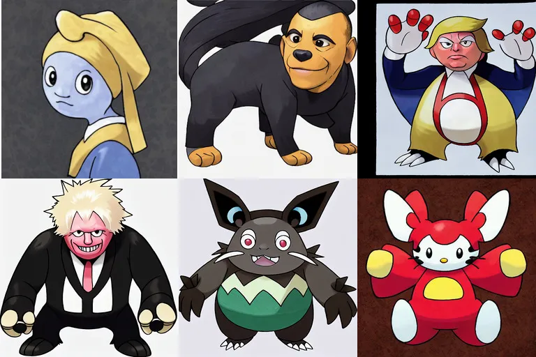
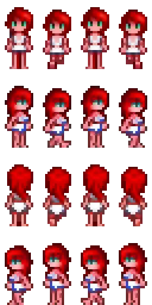
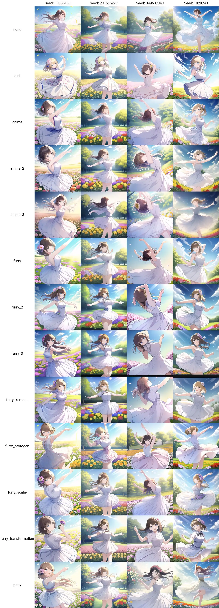

# 架炉生火

这节介绍软件配置和一些关于 WebUI 网页应用模型参数的优化方案，让它更好用。

部分源教程来自：[关于 AUTOMATIC1111 /stable-diffusion-webui 的 FAQ](https://gist.github.com/crosstyan/f912612f4c26e298feec4a2924c41d99)

推荐经常从远端代码库拉取代码 `git pull` 更新 WebUI 网页应用。

SD-WebUI 是一个框架，所以除了 NAI 模型外还有许多 [其他模型](https://rentry.org/sdmodels)

## Pickle 安全提示

[Pickle 的介绍](https://docs.python.org/3/library/pickle.html)，Python object serialization

Pickle 模块在设计上并不安全。

`.ckpt` 和 `.pt` 文件中都可能含有恶意数据，可使得加载期间执行任意代码。原则上，您应该只加载您信任的数据。永远不要加载可能未知来源的、或可能被篡改的数据。

WebUI 内置了一定的安全检查，如果你使用 Automatic1111 的 WebUI, 其在这方面做了一些验证。对于不安全的文件，会提示

```
The file may be malicious, so the program is not going to read it.
You can skip this check with --disable-safe-unpickle commandline argument.
```

:::tip
值得注意的是，出现该提示并不一定表明文件一定危险，有时由于网络问题、内存问题无法完整加载模型时也会出现此提示。
可以结合该提示上方与下方的报错综合分析具体出错原因。
:::

另外，你可以在 [这里](https://github.com/sudoskys/StableDiffusionBook/blob/main/docs/ckpt_safe) 看到一个简单的检查脚本。

相关项目 [pickle_inspector](https://github.com/lopho/pickle_inspector)。

```python
    raise pickle.UnpicklingError("global '%s/%s' is forbidden" %
                                 (module, name))
```

如果你运行脚本得到了类似 "global something.something is forbidden" 这意味着检查点试图做坏事，可能有危险。

## 模型选调

模型使用的数据集和标签对于效果影响非常重要，在使用之前要先了解数据来源。

### Stable Diffusion 模型

Stable Diffusion 模型适用于生成与照片、艺术品类似的图像。

提示词常用连贯的自然语言句子描述一个物体，如：

```
A horse running on the moon
```

下载地址：

-   [Stable Diffusion v1.2](https://huggingface.co/CompVis/stable-diffusion-v-1-2-original)
-   [Stable Diffusion v1.3](https://huggingface.co/CompVis/stable-diffusion-v-1-3-original)
-   [Stable Diffusion v1.4](https://huggingface.co/CompVis/stable-diffusion-v-1-4-original)
-   [Stable Diffusion v1.5](https://huggingface.co/runwayml/stable-diffusion-v1-5)

### Waifu Diffusion 模型

Waifu Diffusion 模型采用 Danbooru 数据集中图片与标签训练，适用于生成各类二次元图像。

提示词常用 Danbooru 提供的标签组合，如：

```
1girl, white hair, blue dress, black shoes
```

下载地址：

-   [Waifu Diffusion v1.3](https://huggingface.co/hakurei/waifu-diffusion-v1-3)

### NovelAI 泄露模型

NovelAI 模型采用 Danbooru 数据集中图片与标签训练，适用于生成各类二次元图像。

提示词常用 Danbooru 提供的标签组合、与部分私有标签，如：

```
masterpiece, best quality, 1girl, white hair, blue dress, black shoes
```

使用该模型的 models 文件夹结构大致如下：

<div style="overflow-x: auto;">
<pre>
./models
├── hypernetworks
│   ├── aini.pt
│   ├── anime_2.pt
│   ├── anime_3.pt
│   ├── anime.pt
│   ├── furry_2.pt
│   ├── furry_3.pt
│   ├── furry_kemono.pt
│   ├── furry_protogen.pt
│   ├── furry.pt
│   ├── furry_scalie.pt
│   ├── furry_transformation.pt
│   └── pony.pt
├── Stable-diffusion
│   ├── model.ckpt -> 任意一个 ckpt 文件
│   ├── model.vae.pt -> animevae.pt
│   ├── model.yaml -> 与 model.ckpt 同文件夹的 config.yaml (无须使用)
│   └── ......
</pre>
</div>

此处给出的文件名仅为示例。可根据自己喜好增删或改名。注意不同扩展名的文件应当拥有相同的前缀。

#### 目前的五种方案

<!-- TODO: 这个效果不是很对 -->

| 名称                    | 需求                           | 备注                                                            |
| ----------------------- | ------------------------------ | --------------------------------------------------------------- |
| SD-WebUI + NAI 4GB 模型 | 至少 3 GB 显存                 | 界面较复杂，调整配置后可达到等同官方的效果。适用于出图。        |
| SD-WebUI + NAI 7GB 模型 | 至少 6 GB 显存                 | 成图与 4GB 模型有一些差别。适用于训练精调，耗费较多内存与显存。 |
| NAIFU + NAI 4GB 模型    | 至少 8GB 内存 + 8GB 显存       | 与官方类似的界面，所需配置较少                                  |
| NAIFU + NAI 7GB 模型    | 至少 8 - 10 GB 显存            | 与官方类似的界面，所需配置较少                                  |
| 官方后端                | 16GBfp16/24GBfp32 & 服务器系统 |                                                                 |

部署 NAI 原版网页 UI + 后端是没有必要的。运行原版套件需要准备一台拥有 12GB 以上显存的 Linux 系统 GPU 服务器，但由于官方配置中启用了 EMA 权重，因此在使用更多显存的同时，模型输出效果与 4 GB 压缩模型并无差别。

#### Part 1

<!-- TODO: 扫了一眼，有很多基本问题，待修 -->

Part 1 中较常用的文件列举如下：

:::warning
受 WebUI 算法限制，在 WebUI 中具有相同 Hash 的模型存在不是同一个模型的可能。
:::

| CRC32      | WebUI Hash | 文件名             | 模型包路径                                     | 说明                                                 |
| ---------- | ---------- | ------------------ | ---------------------------------------------- | ---------------------------------------------------- |
| `31D10243` | `925997E9` | `full-pruned.ckpt` | `stableckpt/animefull-final-pruned/model.ckpt` | 全量 压缩模型                                        |
| `81274D13` | `E6E8E1FC` | `full-latest.ckpt` | `stableckpt/animefull-latest/model.ckpt`       | 全量 完整模型                                        |
| `ADDB53AF` | `1D4A34AF` | `sfw-pruned.ckpt`  | `stableckpt/animesfw-final-pruned/model.ckpt`  | 精选 压缩模型                                        |
| `1D44365E` | `202FCEC0` | `sfw-latest.ckpt`  | `stableckpt/animesfw-final-pruned/model.ckpt`  | 精选 完整模型                                        |
|            |            | `*.vae.pt`         | `stableckpt/animevae.pt`                       | 用于稳定风格，修复饱和度问题                         |
|            |            | `*.yaml`           | `stableckpt/anime*/config.yaml`                | 模型配置文件，主要作用是让完整模型达到压缩模型的效果 |
|            |            |                    | `stableckpt/vector_adjust/v2.pt`               | 未知风格化                                           |

注意，`.yaml` 与 `.vae.pt` 的名称应该与 `.ckpt` 文件相对应。

`hypernetworks` 包含了 `stableckpt/modules/modules` 里的文件，是风格相关的数据集，可以作为特定人物的 `embedding model` 调用，和 model 使用可以生成特定风格。主要格式为 `*.pt`。需要在 WebUI 的设置标签页启用这个增强模型。

#### Part 2

`prodmodels` 是 GPT 模型(语言处理)，但是实际用了 CLIP，所以不用我们管。

`random_stableckpt` 是一些模型，有的与 Part1 重复


::: details 附内容

-   `stableckpt/` - Stable Diffusion checkpoints
-   `animefull-latest` - The model NovelAI uses in production
-   `workspace/` - Code used to train/run/finetune models
-   `sd-private.tar.zst` - Stuff to train Stable Diffusion
-   `github/` - Code taken from GitHub. CREDENTIALS SCRUBBED
-   `novelai/ `- From NovelAI org
-   `*.tar.zst` - Archived git repos, public AND PRIVATE
-   `aboutus.gpg` - Our public GPG key
-   `sha256sum` - SHA256 sums of every file
-   `sha256sum.sig` Detached signature for the sums, signed by our GPG key

:::

启动 cli 有提示加载就 OK，同时可以去设置选模型那里选喜欢的 `hypernetwork`

#### 全量和基线模型

`animesfw-latest` = NAI 基线模型

`animefull-final-pruned` = `full-latest` = NAI 全量模型(包含成人内容)

#### 使用 latest (7G) 还是 pruned (4G) 模型

4GB 的模型由 7GB 的模型修剪而来，去除了最后一次的权重，留下了 EMA 权重。

个人用户只需要使用 pruned 4GB 模型。使用 latest 会过度占用 RAM 和 VRAM。

且 NAI 在线上也使用 EMA 权重，所以选择 latest 7GB 模型是没有意义的。

[结论由此贴讨论得到](https://github.com/AUTOMATIC1111/stable-diffusion-webui/discussions/2017#discussioncomment-3882551)。

#### 关于 EMA

EMA 移动平均值对生成图像没有任何帮助。

但确实可以在后续的训练中防止过拟合。

不确定在 dreambooth 的训练中是否起作用。

#### 详细介绍

拆包视频可以看 [av688965561](https://www.bilibili.com/video/av688965561)

#### 杂项

-   猜测模型中 `masterpiece, best quality` 等在 Danbooru 中不存在的标签有可能是为了适应商业需求而进行补充标记的。
-   猜测 full 模型投入了所有的数据，未经清洗。而 sfw (curated) 模型则数据更加精确，应该受过清洗。这导致了 full 模型的不稳定。
-   在 “事件 2” 中，我们看到了很多其他的模型，比如 `wallpaper` 模型，它们应该使用了不同的数据集进行训练。
-   有些模型可能是根据 `rating` 进行分类的。

但是事实上我们并不知道细节，所以以上只是猜测并且**不可信**的。

### Anything 2.1 / 3.0

融合模型，适用于生成各类二次元图像。

下载地址：https://pan.baidu.com/s/1r--2XuWV--MVoKKmTftM-g?pwd=ANYN

### SD Pokemon Diffusers



经过微调的 Stable Diffusion 模型，专注于生成宝可梦图片。

见 [HuggingFace/lambdalabs/sd-pokemon-diffusers](https://huggingface.co/lambdalabs/sd-pokemon-diffusers)。

### SD PixelArt SpriteSheet Generator



经过微调的 Stable Diffusion 模型，专注于生成多个方向的像素小人。

见 [HuggingFace/Onodofthenorth/SD_PixelArt_SpriteSheet_Generator](https://huggingface.co/Onodofthenorth/SD_PixelArt_SpriteSheet_Generator)。

## 风格化

### Furry 超网络模型比较


### 其他超网络模型比较



参考参数：

> masterpiece, best quality, masterpiece, 1girl, solo, outdoors, flowers, dancing

> Negative prompt: nsfw, lowres, bad anatomy, bad hands, text, error, missing fingers, extra digit, fewer digits, cropped, worst quality, low quality, normal quality, jpeg artifacts,signature, watermark, username, blurry, artist name

> Steps: 28, Sampler: Euler, CFG scale: 12, Seed: [SEE COLUMN], Size: 512x512, Model hash: 925997e9, Hypernet: [SEE ROW]

### 结论

`aini` 有一种你可能不喜欢的强烈风格，我认为它具有最高的一致性和质量。

`anime_3` 是该系列中质量最高的，但它们都有些不一致. 我一般不会推荐他们。

可以看到 `furry` 的超网络在添加动物特征方面更加激进，因此这里更保守的变化可能与采样器、步骤和 CFG 有关。

[所有超网络的 X/Y](https://github.com/AUTOMATIC1111/stable-diffusion-webui/discussions/2017#discussioncomment-3836360)
