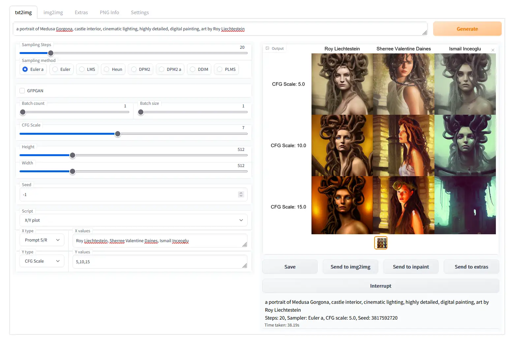
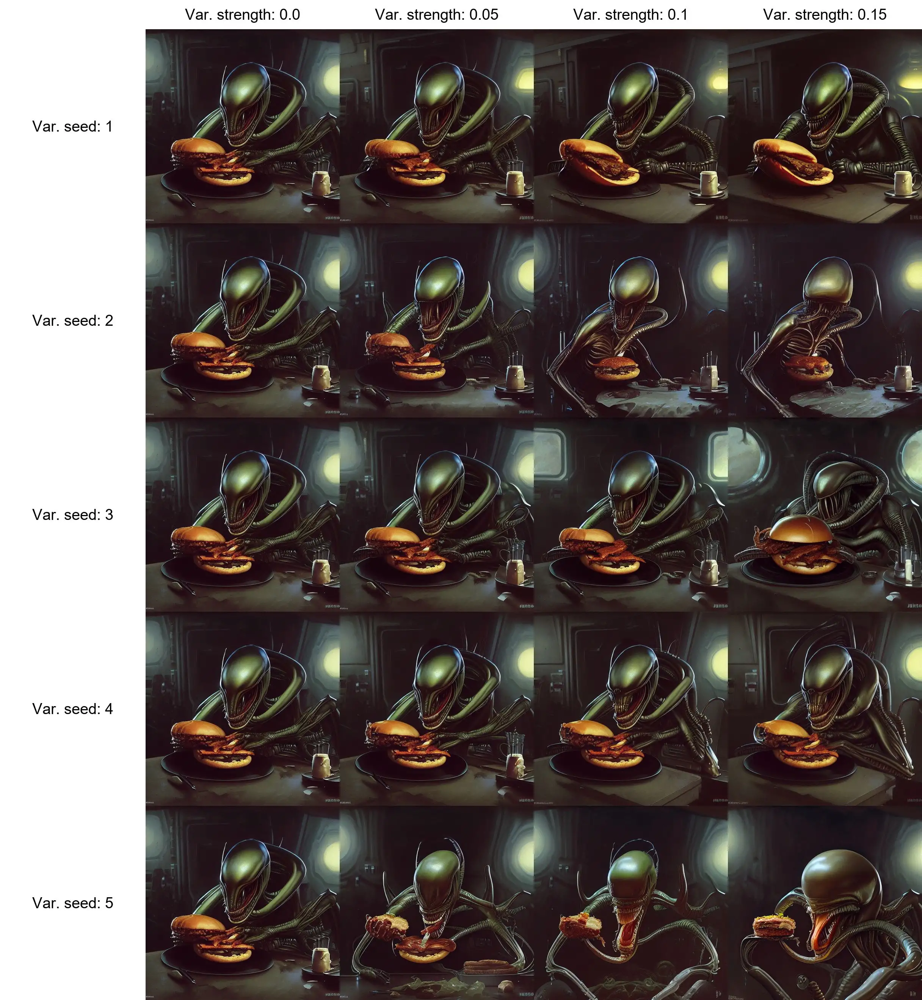

# 进阶配置

## 启动流程

见 [Roaming_info_for_latent_diffusion](http://allophane.com/index.php/2022/10/17/roaming_info_for_latent_diffusion/)


## 半精度还是单精度？

如果能，尽量使用半精度，可以节省运算时间/RAM/VRAM，同时图片质量并不会和单精度差多少。~~真要说差别可能和你电脑被宇宙射线打了差不多。~~

## X/Y 图

创建具有不同参数的图像网格。使用X类型和Y类型字段选择应由行和列共享的参数，并将这些参数以逗号分隔输入X值/Y值字段。支持整数、浮点数和范围。

### Simple ranges 简单范围

```text
1-5 = 1, 2, 3, 4, 5
```

### Ranges with increment in bracket 括号范围

```text
1-5 (+2) = 1, 3, 5
10-5 (-3) = 10, 7
1-3 (+0.5) = 1, 1.5, 2, 2.5, 3
```

### Ranges with the count in square brackets 方括号范围

```text
1-10 [5] = 1, 3, 5, 7, 10
0.0-1.0 [6] = 0.0, 0.2, 0.4, 0.6, 0.8, 1.0
```

### Prompt S/R 替换

S/R 是 X/Y 图的的一种较难理解的操作模式。

S/R 是 搜索/替换 的意思，输入一个单词或短语的列表，它从列表中取第一个并将其视为关键词，并将该关键词的所有实例替换为列表中的其他条目的所有实例替换为列表中的其他条目。

例如，提示 `a man holding an apple, 8k clean` 和 S/R提示 `an apple, a watermelon, a gun` 结合，你会得到三个提示。

* `a man holding an apple, 8k clean`
* `a man holding a watermelon, 8k clean`
* `a man holding a gun, 8k clean`

列表使用的语法与CSV文件中的一行相同，所以如果你想在你的条目中加入逗号，你可以
在你的条目中加入逗号，你必须将文本放在引号中，并确保引号之间没有空格。
确保引号和分隔逗号之间没有空格。

* `darkness, light, green, heat` - 4 items - `darkness`, `light`, `green`, `heat`
* `darkness, "light, green", heat` - WRONG - 4 items - `darkness`, `"light`, `green"`, `heat`
* `darkness,"light, green",heat` - RIGHT - 3 items - `darkness`, `light, green`, `heat`

### 设置示例

引用官方 Wiki 的设置图：



## Variations 种子变化

`Variation strength slider` 和 `Variation seed field` 允许您指定现有图片应更改多少以使其看起来不同。
在最大强度下，图片种子将完全取决于 Variation seed；在最小强度下，图片种子将完全取决于原始种子。（使用 Ancestral 采样器时除外）。



## 提示词模板

`Save prompt as style` 按钮可将当前的提示词写入 `styles.csv` 作为模板使用。该文件包含所有保存的模板。

右侧的下拉框将允许您从以前保存的样式中选择任何样式，并自动将其**附加**到输入中

要删除样式，请从 `styles.csv` 中手动将其删除并重新启动程序。

## xformers

xformers 分辨率越高加速效果越好。使用 xformers 会引入一些随机性，稍微影响生成的图像。

如果你使用 Pascal、Turing 或者 Ampere 架构的卡（包括 GTX 1000，RTX 2000、3000 系列），将 `--xformers` 参数添加到 `webui-user.bat` 中的 `COMMANDLINE_ARGS`。**不需要再按照下述步骤编译安装。**

::: tip
有人说在 700 和 900 系列卡上使用 xformers 的性能明显较差，请注意这一点。
本人实测，2050 在启用 xformers 之后，速度慢了 50%
:::

::: warning
注意使用 xformers 优化加速将使得同种子生成的图片存在细微差异。
:::

### 在 Windows 上编译 Xformers

::: tip
你可以在 [这里](https://rentry.org/25i6yn) 下载预构建的 xformers！记得先查看 [GPU 架构](https://developer.nvidia.com/cuda-gpus)
:::

确保 Python 版本为 3.10 或更高版本(使用 `python --version` 查看)，然后安装下述应用：

<!-- TODO: 11.6 没问题 -->

- 安装 [VS Build Tools 2022](https://visualstudio.microsoft.com/zh-hans/downloads/?q=build+tools)，运行安装时只需要选择 `Desktop development with C++`
- 安装 [CUDA Toolkit](https://developer.nvidia.com/cuda-downloads)。可选择`Custom` 安装方式，删除一些如 Nsight、Visual Studio 集成等无用组件。

1. 确认 nvcc 可用

```cmd
nvcc --version
```

2. 克隆 `xFormers` 存储库，在环境中激活它

```cmd
git clone https://github.com/facebookresearch/xformers.git
cd xformers
git submodule update --init --recursive
```

3. 创建虚拟环境且激活环境

```bash
python -m venv venv

#CMD
venv\Scripts\activate.bat
#Bash
source ./venv/bin/activate
#WindowsBash
source ./venv/Scripts/activate
```

4. 为避免获取 CPU 版本时出现问题，请单独安装 pyTorch：

```bash
pip install torch torchvision --extra-index-url https://download.pytorch.org/whl/cu113
```

5. 然后安装其余的依赖项

```bash
pip install -r requirements.txt
pip install wheel
pip install ninja
```

6. 如果使用 CUDA 11.6 之前的旧版本，需要强制启用它以在 MS Build Tools 2022 上构建。

在 CMD 设置 

```cmd
set NVCC_FLAGS=-allow-unsupported-compiler"
```

或在 Bash 设置

```bash
export NVCC_FLAGS=-allow-unsupported-compiler
```

7. 查看你自己的 GPU 架构

[GPU 架构表](https://developer.nvidia.com/cuda-gpus)

比如说，如果你的 GPU 是 GTX 1070，基于该表，架构是 6.1

*CMD*
```cmd
set TORCH_CUDA_ARCH_LIST=6.1
```

*BASH*  
```bash
export TORCH_CUDA_ARCH_LIST=6.1
```

8. 构建 xFormers，请注意构建将需要很长时间（可能需要 10-20 分钟），它最初可能会抱怨一些错误，但它仍然应该可以正确编译。

9. 在环境中安装

```bash
python setup.py build
python setup.py bdist_wheel
```

找到 dist 文件夹并将文件 `*.whl` 复制到 `stable-diffusion-webui`

在 `stable-diffusion-webui` 目录中安装`.whl`。

如果构建的 whl 名称不同，请在下面的安装命令中更改文件名

```bash
#CMD
./venv/scripts/activate
#Bash
source ./venv/bin/activate
#WindowsBash
source ./venv/Scripts/activate
pip install xformers-0.0.14.dev0-cp310-cp310-win_amd64.whl
```

30 系显卡正常启动，在 `COMMANDLINE_ARGS=` 加 `--xformers` 参数, 其他显卡加 `--force-enable-xformers` 参数

#### Windows 编译错误自查

> 错误:`Filename too long` 和 `fatal error C1083: Cannot open compiler generated file: '': Invalid argument`

说明你的路径太长了。

> RuntimeError: CUDA error: no kernel image is available for execution on the device

现在更多 GPU 架构是自动支持的，尝试重新安装并使用 --xformers 参数。

如果你移动了 xformers，那么应该删除里面的 venv 目录。

[Windows](https://github.com/C43H66N12O12S2/stable-diffusion-webui/releases) (30 系之外要自己编译)

自己编译指路 [wiki/Xformers](https://rentry.org/sdg_faq#xformers-increase-your-its-more-cards-supported) 还有 [这个 Post](https://www.reddit.com/r/StableDiffusion/comments/xz26lq/automatic1111_xformers_cross_attention_with_on/)

## 使用 CPU 进行绘画

根据此 [PR](https://github.com/AUTOMATIC1111/stable-diffusion-webui/pull/2597)

可以通过 `--use-cpu all` 尽可能的使用CPU进行生成，虽然慢 100 倍。

## CLIP Interrogate

CLIP 可以从图像中提取令牌。

默认情况下，只有一个列表 - 艺术家列表（来自 artists.csv）。

不过你可以通过执行以下操作添加更多列表：
* 在与 `webui.py` 相同的位置创建 `interrogate` 目录
* 将文本文件放入其中，每行包含相关描述

你可以在[这里](https://github.com/pharmapsychotic/clip-interrogator/tree/main/data)查看使用哪个文本文件的例子。实际上，你可以直接用这个例子中的文件 —— 除了 `artists.txt` ，你已经有一份艺术家列表在 `artists.csv` 中了不是吗（或者用这个也行，随你）。每个文件都会使最后的描述增加一行字。如果你将 `.top3.` 放到文件名中，比如 `flavors.top3.txt` ，文件中相关度最高的三行将会被添加到提示词中（其他数量也行）。

<!-- TODO: DeepDanbooru Interrogate -->

## DeepDanbooru Interrogate

新版 Stable-Diffusion-WebUI 已无需使用 `--deepdanbooru` 开关启用该功能。

可在 img2img / 图生图 页面中看到 DeepDanbooru Interrogate 按钮。可以从图像中提取令牌。

## Face restoration 三次元人脸修复

适用于三次元。

[Face Restoration @ WebUI Wiki](https://github.com/AUTOMATIC1111/stable-diffusion-webui/wiki/Features#face-restoration)

## 自定义.css

创建一个名为 user.css 的文件并放在 webui.py 旁，将自定义 CSS 代码放入 user.css 中。

下面的例子将设置画廊的最短长度：

```css
#txt2img_gallery, #img2img_gallery{
    min-height: 768px;
}
```

## 更换提示音

如果在 webui.py 附近存在 `notification.mp3` 文件，它将在图片生成结束后播放。


## 修剪模型

见 [Voldy Retard Guide - Pruning a .CKPT](https://rentry.co/voldy#-pruning-a-ckpt-)。

将要修剪的 `.ckpt` 文件放在 `/stable-diffusion-webui` 文件夹，把 [脚本](https://raw.githubusercontent.com/harubaru/waifu-diffusion/main/scripts/prune.py) 另存本地，删除第 6 行和 第 8 行。然后在 prune.py 中的最后一行编辑 ckpt 的名称。

比如，`prune_it('wd-v1-2-full-emma.ckpt')`

然后运行这个脚本，修剪过程可能需要几分钟。

## 速度判定

注意区分 `it/s` 与 `s/it`。

终端的 `it/s` 速率是大致速率，在一秒钟可完成多次迭代时显示，代表每秒钟迭代次数。数字升高代表加速。

`s/it` 速率是上值的倒数，在一秒钟无法完成一次迭代时显示，代表每次迭代所需秒数。因此，数字降低代表加速。
