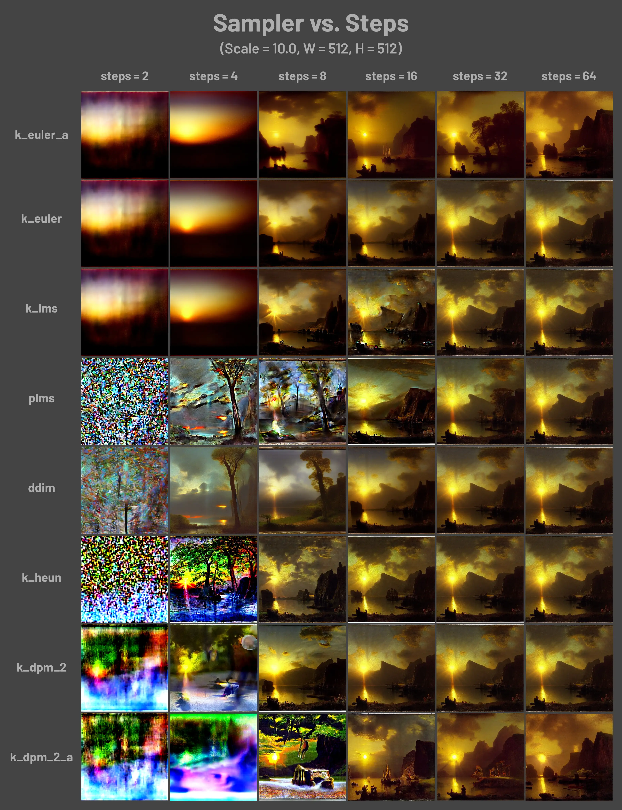

# 调参基础

本章内容大多基于 Stable Diffusion WebUI 前端。NovelAI 原始界面只开放了所有设置的一小部分。

## 常用参数介绍

-   Prompt（提示词）：对你想要生成的东西进行文字描述。
-   Negative prompt（反向提示词）：用文字描述你不希望在图像中出现的东西。
-   Sampling Steps（采样步数）：扩散模型的工作方式是从随机高斯噪声向符合提示的图像迈出小步。这样的步骤应该有多少个。更多的步骤意味着从噪声到图像的更小、更精确的步骤。增加这一点直接增加了生成图像所需的时间。回报递减，取决于采样器。
-   Sampling method（采样器）：使用哪种采样器。Euler a（ancestral 的简称）以较少的步数产生很大的多样性，但很难做小的调整。随着步数的增加，非 ancestral 采样器都会产生基本相同的图像，如果你不确定的话，可以使用 LMS。
-   Batch count/n_iter：每次生成图像的组数。一次运行生成图像的数量为 Batch count \* Batch size。
-   Batch size：同时生成多少个图像。增加这个值可以提高性能，但你也需要更多的 VRAM。图像总数是这个值乘以批次数。除 4090 等高级显卡以外通常保持为 1。
-   CFG Scale（无分类指导规模）：图像与你的提示的匹配程度。增加这个值将导致图像更接近你的提示（根据模型），但它也在一定程度上降低了图像质量。可以用更多的采样步骤来抵消。
-   Width：图像的宽度，像素。要增加这个值，你需要更多的显存。大尺度的图像一致性会随着分辨率的提高而变差（模型是在 512x512 的基础上训练的）。非常小的值（例如 256 像素）也会降低图像质量。这个值必须是 8 的倍数。
-   Height：图像高度。
-   Seed：随机数的起点。保持这个值不变，可以多次生成相同（或几乎相同，如果启用了 xformers）的图像。没有什么种子天生就比其他的好，但如果你只是稍微改变你的输入参数，以前产生好结果的种子很可能仍然会产生好结果。

来自 [installgentoo wiki](https://wiki.installgentoo.com/wiki/Stable_Diffusion)

[一个小指南：RedditAbout](https://www.reddit.com/r/StableDiffusion/comments/xbeyw3/can_anyone_offer_a_little_guidance_on_the/)

## Sampling steps 迭代步数

::: info
迭代是重复反馈的动作，神经网络中我们希望通过迭代进行多次的训练以到达所需的目标或结果。
每一次迭代得到的结果都会被作为下一次迭代的初始值。
一个迭代 = 一个正向通过 + 一个反向通过
:::

更多的迭代步数可能会有更好的生成效果，更多细节和锐化，但是会导致生成时间变长。而在实际应用中，30 步和 50 步之间的差异几乎无法区分。

太多的迭代步数也可能适得其反，几乎不会有提高。

进行图生图的时候，正常情况下更弱的降噪强度需要更少的迭代步数(这是工作原理决定的)。你可以在设置里更改设置，让程序确切执行滑块指定的迭代步数。

## Samplers 采样器

目前好用的有 `Euler`，`Euler a`（更细腻），和 `DDIM`。

推荐 `Euler a` 和 `DDIM`，**新手推荐使用 `Euler a`**

`Euler a` 富有创造力，不同步数可以生产出不同的图片。调太高步数 (>30) 效果不会更好。

`DDIM` 收敛快，但效率相对较低，因为需要很多 step 才能获得好的结果，**适合在重绘时候使用**

`LMS` 和 `PLMS` 是 `Euler` 的衍生，它们使用一种相关但稍有不同的方法（平均过去的几个步骤以提高准确性）。大概 30 step 可以得到稳定结果

`PLMS` 是一种有效的 LMS（经典方法），可以更好地处理神经网络结构中的奇异性

`DPM2` 是一种神奇的方法，它旨在改进 DDIM，减少步骤以获得良好的结果。它需要每一步运行两次去噪，它的速度大约是 DDIM 的两倍。但是如果你在进行调试提示词的实验，这个采样器效果不怎么样

`Euler` 是最简单的，因此也是最快的之一

[英文 Wiki 介绍](https://github.com/AUTOMATIC1111/stable-diffusion-webui/wiki/Features#attentionemphasis)

[英文论坛介绍](https://www.reddit.com/r/StableDiffusion/comments/xbeyw3/can_anyone_offer_a_little_guidance_on_the/)

不同 Step 和 采样器 的不同效果示例：

| 预览一                                                                             | 预览二                                                                            |
| ---------------------------------------------------------------------------------- | --------------------------------------------------------------------------------- |
| {width=3654 height=4756 loading=lazy} | {width=983 height=1280 loading=lazy} |

## CFG Scale 提示词相关性

`cfg scale` 是图像与提示词的契合度，该值越高，提示词对最终生成结果的影响越大，契合度越高。

过高的 CFG Scale 体现为粗犷的线条和过锐化的图像。

## 注意尺寸

出图尺寸太宽时，图中可能会出现多个主体。

要匹配好姿势，镜头和人物才不畸形，有时候需要限定量词，多人物时要处理空间关系和 prompt 遮挡优先级。人数->人物样貌->环境样式->人物状态

1024 之上的尺寸可能会出现不理想的结果！推荐使用 **小尺寸分辨率 + 高清修复**（下方介绍）。

## Highres. fix 高清修复

通过勾选 txt2img（文生图） 页面上的 "Highres. fix" 复选框来启用。

默认情况下，txt2img（文生图） 在高分辨率下会生成非常混沌的图像。该选项会使得模型首先生成一张小图片，然后通过 img2img 将图片分辨率扩大，以实现高清大图效果。

## Batch Count 与 Batch Size

-   `Batch Count（生成批次）` 指定共生成几个批次。
-   `Batch Size（每批数量）` 指定每个批次并行生产多少张图片。

大的 Batch Size 需要消耗巨量显存。若您的显卡没有超过 12G 的显存，请不要调节 Batch Size。

对于显存极大的显卡而言，一次生成一张图片无法充分利用显卡计算容量，此时可将 `Batch Size` 提高以充分压榨算力。

## 随机种子

理论上，种子决定模型在生成图片时涉及的所有随机性。

实际的种子数值并不重要。它只是初始化一个定义扩散起点的随机初始值。

在应用完全相同参数（如 Step、CFG、Seed、prompts）的情况下，生产的图片应当完全相同。(不使用 `xformers` 等会带来干扰的优化器)

不同显卡由于微架构不同，可能会造成预料之外的不同结果。主要体现在 GTX 10xx 系列显卡上。详见 [这里的讨论](https://github.com/AUTOMATIC1111/stable-diffusion-webui/discussions/2017#discussioncomment-3873467)。

## Denoising strength 降噪强度

`Denoising strength` 仅在 img2img（图生图）或 高清修复 时被应用，其表征最后生成图片对原始输入图像内容的变化程度。通过调整该值，可以降低对画风的影响，但也会弱化 img2img 能力。值越高 AI 对原图的参考程度就越低 (同时增加迭代次数)。

对于图生图来说，低 `denoising` 意味着修正原图，高 `denoising` 就和原图就没有大的相关性了。一般来讲阈值是 0.7 左右，超过 0.7 和原图基本上无关，0.3 以下就是稍微改一些。

实际执行中，具体的执行步骤为 Denoising strength \* Sampling Steps。

## 不间断生成

在 WebUI 的生成键上右击即可出现 **不间断生成** 的选项。

## 使用 WebUI 复现 NAI 官网结果

[相关讨论，应该读一读！](https://github.com/AUTOMATIC1111/stable-diffusion-webui/discussions/2017)

::: tip
由于 xformers 在优化过程中引入的抖动与部分显卡微架构差异，尝试完全复原在不同机器上生成的图片是不明智的。所以不要纠结一些细节不能复现。
:::

### 需要做的事情

-   如果使用 7G 模型，需要将 `config.yml` 改名为 `模型名.yml` 与模型文件放置在一起。这种加载方式会消耗大量显存并减慢加载速度。如果使用 4G 模型，无需进行任何操作即可达到等同效果。
-   启用 xformers
-   加载 `animevae.pt` 模型（将该模型文件改名为 `模型名.vae.pt` 与模型文件放置在一起）
-   Settings 中将 `Stop At last layers of CLIP model` 设为 `2`
    -   匹配 NAI 的一个[优化](https://blog.novelai.net/novelai-improvements-on-stable-diffusion-e10d38db82ac)。
-   Settings 中将 `Eta noise seed delta` 设置为 `31337`
-   将 NovelAI 自动填充的正反标签前置在提示词组中
    -   正向标签：`masterpiece, best quality, `
    -   反向标签：`lowres, bad anatomy, bad hands, text, error, missing fingers, extra digit, fewer digits, cropped, worst quality, low quality, normal quality, jpeg artifacts, signature, watermark, username, blurry`
-   如果使用大括号，将大括号翻译为权重数字（每个大括号 105%）
    -   将 `{...}` 翻译为 `(...:1.05)`
    -   将 `[...]` 翻译为 `(...:0.9091)`

### 不需要做的事情

-   加载模型包中的 hypernetwork。官网默认并不使用 hypernetwork。
