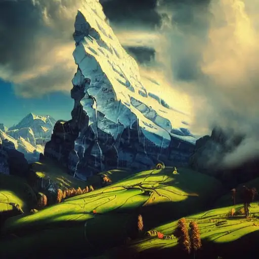
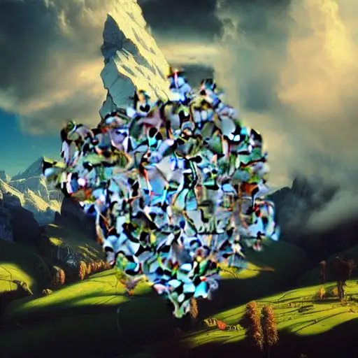
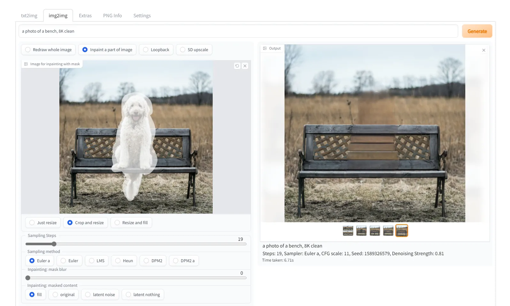

# 图片转图片

一般我们有两种途径对图像进行修复：**PS 和 InPaint**，使用方法也十分多样。

WebUI 使用 `--gradio-img2img-tool color-sketch` 启动会带入一个插件对图片进行颜色涂抹(这里不是 Inpaint)

## 处理图片大小

-   Just resize : 将图像调整为目标分辨率。除非高度和宽度完全匹配，否则图片会被挤压
-   Crop and resize：调整图像大小，使整个目标分辨率都被图像填充。裁剪多余部分。
-   Resize and fill：调整图像大小，使整个图像在目标分辨率内。用图像的颜色填充空白区域。

## 注意颜色

无论是 3D (DAZ 这样的 3D 模型) 还是线稿，AI 只识别 **色彩** ，而不是线条，色彩直接决定图转图的效果。

## 三渲二

调整 3D 模型骨架比寻找样图更容易。

可以结合 **3D 建模** 摆 Pose，也可以使用 MMD 相关软件。

如果是真人图片，需要适当提高 `CFG Scale` 相似度，结合提示词一起生成。降噪 `Denoising` 越高，相关性越低。

推荐使用 [DAZ](https://www.daz3d.com/get_studio) 或者 [Blender](https://www.blender.org/) 或者 Unity ，在对 3D 模型的测试中，**色彩主要影响 AI 的绘画效果**，所以你的模型需要有纹理。

如果你使用 Blender ，你可以使用 [这个视频](https://youtu.be/MClbPwu-75o) 分享的 [模型娃娃](https://www.artstation.com/marketplace/p/VOAyv/stable-diffusion-3d-posable-manekin-doll?utm_source=artstation&utm_medium=referral&utm_campaign=homepage&utm_term=marketplace)

## Inpainting 修补

::: tip 不同之处
PS 重新绘画投入 Img2Img 的话，会导致画风的变动，而 Inpaint 就不会。
:::

在 Inpainting 选项卡中，在图像的一部分上绘制蒙版，该部分将被重新绘制。

`Masked content` 设置确定在修复之前放置到遮罩区域中的内容，一般选 `original`，可以保持图片一致性，如果你不希望修补内容继承原来的色彩分布，选 `fill` 就是使用图片的大部分底色，选 `latent noise` 可以获得随机色彩点阵图（使生成内容脱离关联）。

它们的效果如下:

| 示意操作                                                                                  | fill                                                                                      | original                                                                                      | latent noise                                                                                      | latent nothing                                                                                      |
| ----------------------------------------------------------------------------------------- | ----------------------------------------------------------------------------------------- | --------------------------------------------------------------------------------------------- | ------------------------------------------------------------------------------------------------- | --------------------------------------------------------------------------------------------------- |
| {width=484 height=482 loading=lazy} | {width=512 height=512 loading=lazy} | {width=512 height=512 loading=lazy} | {width=512 height=512 loading=lazy} | {width=512 height=512 loading=lazy} |

`mask` 横条决定了涂抹区块边缘的平滑程度。original 指代 `原图`，fill 是 `填充底色`。

::: tip
`fill` 要更多 step 才能消除不自然感.
:::

`mask` 横条决定了模糊程度。original 是`原图`，fill 是`填充底色`，`fill` 要更多 step 才能消除不自然感。

`Inpaint at full resolution` 即全分辨率修复。默认情况下 Inpaint 会将生成的图像大小 **整体** 调整为 _UI 中指定的目标分辨率_。启用 `Inpaint at full resolution` 后，**仅调整遮罩区域** 的大小，并在处理后将其 **粘贴回** 原始图片。这允许你处理大尺寸图片，并允许以更大的分辨率渲染修复对象。

目前有几种方法进行重绘制操作：

-   使用鼠标在网页上绘制蒙版（`Inpaint masked` 指重画涂鸦区域，`Inpaint not masked` 指重画除涂鸦之外的区域）
-   在外部编辑器中擦除部分图片并上传透明图片。 透明区域会成为蒙版的一部分。注意：某些编辑器默认将完全透明的区域保存为黑色。
-   将模式（图片右下角）更改为 "Upload mask" 并为蒙版处理为单独的黑白图像(白色部分会被 inpaint)。

如果 `inpaint at full resolution` 出现黑块，可能是内存不足，尝试卸载 VAE 模型。

{width=1597 height=957 loading=lazy}

[开源调研-AI 绘画全参数讲解-002img2img 图像到图像](https://www.bilibili.com/video/BV1HK411Q7uk)

通过这种方法，我们可以更改角色衣物风格或者其他任何细节。

[如何教会 AI 画手](https://www.bilibili.com/video/av559044202)

## Outpainting 外部修补

Outpainting 扩展原始图像并修复创建的空白空间。

您可以在 img2img 选项卡底部的 Script -> Poor man's outpainting 中找到该功能。

与正常的图像生成不同，Outpainting 似乎从大步数中受益匪浅。一个好的外绘需要一组与图片相匹配的优秀提示词、最大的 Denoising 和 CFG 比例，以及使用 Euler a 或 DPM2 a 生成 50 到 100 步数。

## Loopback 回环生成

在 img2img 中设置 loopback 脚本，它允许自动将输出图像设为下一批的输入图像。

Batch 数设置控制获得多少次迭代

通常，在执行此操作时，您需要自己为下一次迭代选择许多图像中的一个，因此此功能的有用性可能值得怀疑，但反正我已经设法获得了一些我无法获得的非常好的输出。

## 从附加信息提取提示词

程序默认会在图片中加入提示词，参数，模型信息，对于没有压缩的原图，可以拖入 `PNG Info` 选项卡，查看其内嵌的生成信息。

也可以使用 [在线工具](https://spell.novelai.dev/) 查看它。

## Denoising strength 降噪强度

见 [Denoising strength 降噪强度](../../guide/configuration/param-basic.md#denoising-strength-降噪强度)。

值越低，生成的图片与原图的差距越小。通常由图片清晰度与风格共同确定。

## 从图片内容提取提示词

### CLIP Interrogate

CLIP 可以从图像中提取令牌。

默认情况下，只有一个列表 - 艺术家列表（来自 artists.csv）。

不过你可以通过执行以下操作添加更多列表：

-   在与 `webui.py` 相同的位置创建 `interrogate` 目录
-   将文本文件放入其中，每行包含相关描述

你可以在[这里](https://github.com/pharmapsychotic/clip-interrogator/tree/main/data)查看使用哪个文本文件的例子。实际上，你可以直接用这个例子中的文件 —— 除了 `artists.txt` ，你已经有一份艺术家列表在 `artists.csv` 中了不是吗（或者用这个也行，随你）。每个文件都会使最后的描述增加一行字。如果你将 `.top3.` 放到文件名中，比如 `flavors.top3.txt` ，文件中相关度最高的三行将会被添加到提示词中（其他数量也行）。

### DeepDanbooru Interrogate

新版 Stable-Diffusion-WebUI 已无需使用 `--deepdanbooru` 开关启用该功能。

可在 img2img / 图生图 页面中看到 DeepDanbooru Interrogate 按钮。可以从图像中提取令牌。

设置页面中可以配置是否使用空格代替下划线 (`use spaces for tags in deepbooru`)，及是否自动使用 `\` 转义括号 (`escape (\) brackets in deepbooru (so they are used as literal brackets and not for emphasis)`)。

## 低显存生成大分辨率图片

如果遇到生成鬼图或者低显存生产高分辨率图片，可以采用 Img2Img 画质提升脚本。

**强烈推荐**使用 [Extras](../../guide/configuration/param-advanced#附加功能-extras) 功能对低分辨率进行超分辨率处理。

### 使用脚本

如果你想使用脚本提供的分辨率增强，这里有 Img2Img 的具体流程：

1. 使用 `--medvram` 或者 `--lowvram` 参数启动 webui
2. 选择较小分辨率生成图片。记住生成图片的分辨率。生成完毕之后，复制图片的 `Seed`
3. 生成完毕后，先查看图片效果是否满意。如果满意，直接将图片送进 Img2img。（点击 `Send to img2img`）
4. 在 img2img 界面底部，有一个 `Script` 选项。将 `Script` 选为 `SD Upscale`，里面的 Tile overlap 尽量调小
5. 一般送入 Img2img 的图，输入框自动填充原提示词。如果你发现 prompt 有变动，请手动填充
6. 选择合适的 `Sampling Steps` 和 `Sampling method`
7. 确认你的 `Width` 和 `Height` 与**原图**一致
8. 将第 2 步复制的 Seed 填入 img2img 的 Seed 里并生成

这里的 Width 和 Height 是超分时 img2img 的图片大小，如果不等会导致出现重叠问题

SD Upscale 选项在 Img2Img 的 Script 栏目中，主要作用是提升分辨率。

[脚本解决方案来源于此](https://gist.github.com/crosstyan/f912612f4c26e298feec4a2924c41d99#%E9%AB%98%E5%88%86%E8%BE%A8%E7%8E%87%E4%B8%8B%E5%87%BA%E6%80%AA%E5%9B%BE)
